# AZURE DevOps
* Azure DevOps is a pipeline tool. In this
    * Countinous Intigration
    * Countinous Delivery
    * Countinous Deployment
* Thats why it is also called as CI/CD pipelines.
## CI/CD Pipelines
#### Countinous Intigration:
* Continuous integration (CI) is the process of automatically building and testing code every time a team member commits code changes to version control. A code commit to the main or trunk branch of a shared repository triggers the automated build system to build, test, and validate the full branch.
#### Countinous Deployment:
* Continuous deployment (the other possible "CD") can refer to automatically releasing a developer’s changes from the repository to production, where it is usable by customers. It addresses the problem of overloading operations teams with manual processes that slow down app delivery.
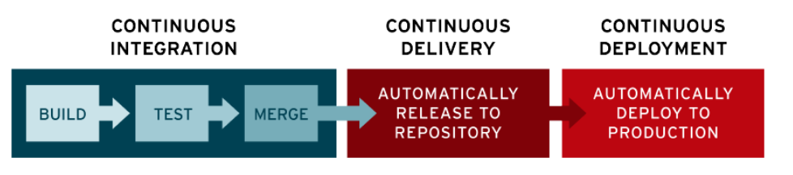
### Big Bang integration
* Consider a case where you are working for vintage systems where we are developing ecommerce application in Waterfall model.
* Application is in layered architecture
    * Presentation Layer
        * Web server
    * Business Layer
        * ECommerce server
    * Data Layer
        * image or video server
        * Data server
* Big Bang integrations are error prone, so best solution would be continuos integration (CI).
* The Goal of CI is to inform dev teams about the failures of integration.
* To perform CI different tools started like cruise control and hudson/jenkins
* Need for automated tests/unit tests started at this point.
##### Agile way of Software Development
* Agile had added smaller and frequent releases, this needs more aggressive automations than CI.
###### Expectation:
* Automated Pipeline which when developer pushes changes
    * Build/Package code
    * Code Quality and Security Issues
* Automate test executions with System, Performance, Reliablity, Security
* Report of the Quality of work done yesterday
* Customer and Internal Releases every 2 weeks
###### Plan ahead
    * Git Basics
    * YAML
    * Azure DevOPs
        * Boards
        * Build & Release Pipelines (*)
        * Artifacts
        * Documentation
        * Azure Source Repos
        * ****
##### Code Base: Open Source
    * .net
    * java
    * Workshop:
        * python
        * node js
#### Countinous Delivery:
* Continuous delivery (CD) is the process of automating build, test, configuration, and deployment from a build to a production environment. A release pipeline can create multiple testing or staging environments to automate infrastructure creation and deploy new builds.
* This pipeline will be triggered by the changes in the Version Control Systems (VCS).
#### WOW (Ways of Working)
* Figure out the manual steps
* Implement manual steps in Pipeline depending on your ci/cd engine
* Steps for gameoflife
* Softwares requried
    * git
    * jdk 8
    * maven
* Run the game of life manually by using following commands
---
* sudo apt update
* sudo apt install openjdk-8-jdk maven -y
* java -version
* mvn -version
* git clone https://github.com/wakaleo/game-of-life.git
* cd game-of-life
* mvn package
* cd gameoflife-web/target
* ls
---
* Pipeline in Jenkins
```json
---
pipeline {
    agent any
    stages {
        stage ('vcs') {
            steps {
                git 'https://github.com/wakaleo/game-of-life.git'
            }
        }
        stage ('build') {
            steps {
                sh 'mvn package'
            }
        }
    }
}
```
* Pipeline in Azure DevOps
```yaml
---
steps:
- task: Maven@4
  inputs:
    mavenPomFile: 'pom.xml'
    goals: 'package'
---
* Pipeline in git
---
run:
  script:
    - mvn package
    # run the command here
  artifacts:
    paths:
      - gameoflife-web/target/*.war
```
* Version control system is GIT
### Git
* Git is a Distributed Version Control System
* Git is Hosted by many providers
    * GitHub
    * Azure Source Repos
    * Code Commit
    * Bit Bucket
    * Git Lab
* The storage location is called repositry.
### Git – Basics
* Scope of the current discussion would be on how to submit the changes to the Git Repository and how to get latest changes from git repository
###### Workflow
* Setting up a GitHub Account
* Setting up a user details and credentials (key based credentials)
* Creating a Git Repository, Adding code/docs submitting to the repository
###### System Setup:
    * Softwares:
        * Terminal (Windows)
        * Git
        * Chocolatey (Windows)
        * home brew Mac
        * Visual Studio Code
### Git Workflow
* Git Remote Repositories are hosted by GitHub/GitLab/Azure Source Repos etc
* If we don’t have the Code in local system, then we clone the code to create local repo
* Once we have local repo, to get latest changes we use pull
* We add the changes to the staging area using add and commit the changes to local repo using commit and sync the changes from local to remote repo using push command
---
* git status
* git add .
* git commit -m "added changes"
* git push
* git pull
---
* Above commands are used regulary.
#### Branches in Git
* Git allows us to work parallely for different use cases
    * multiple versions of same application
    * multiple customers for same application
* HEAD is a pointer which generally points to a branch
HEAD can be moved from one branch to other using a command called as checkout
* The moving HEAD is called checkout
* Now excuite the chrckout command by using the following commands
---
* cd onedrive/desktop
* cd /c/temp
* ls
* git clone <git code>
* ls
* cd nopcommerce
* git branch
* git branch -r
* git checkout master
* git branch
* git branch -r
* git remote add azure <git code> git@github.com:nopSolutions/nopCommerce.git
* git pull azure master
* git branch -r
---
* By using Checkout command we can change one branch to another branch.

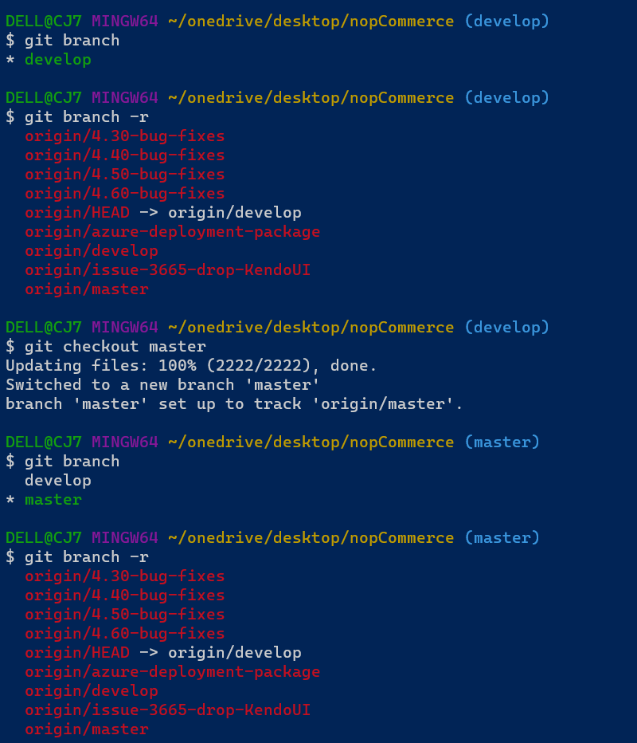
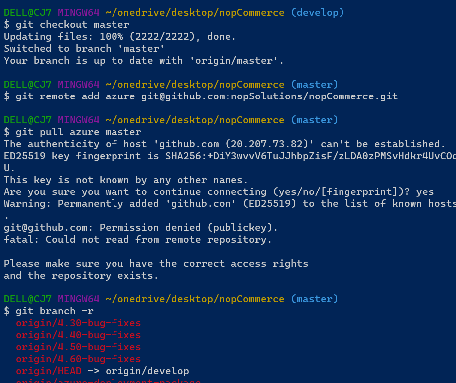
* Things to digest
    * default branch: master
    * default remote: origin
    * remote branch: name of remote/name of branch
##### Building and Packaging the code
* Building the code and packaging the code to the suitable format for end deployment is very technology specific i.e. it is different depending on programming languages.
* Programming Languages can be categorized into 3 formats
    * Compiler based:
        * A compiler is a special program that translates a programming language's source code into machine code, bytecode or another programming language. The source code is typically written in a high-level, human-readable language such as Java or C++.
    * Interpreter based
        * An Interpreter directly executes instructions written in a programming or scripting language without previously converting them to an object code or machine code. Examples of interpreted languages are Perl, Python and Matlab.
    * Hybrid
        * Hybrid is like a compiler but not compiler. Hybrid is like a interpreter but not interpreter.
###### Dependecny Managment
* To develop any application , there will be lots of dependencies on other libraries/sdks
* sdks is some of the reusual code already written
* before building/packaging we need to download these dependencies
    * nodejs npm
    * python pip
    * .net nuget
    * java mvn
###### Test Executions
* We would be running
    * unit tests (test code by writing code) it is generlly wriiten by developers
    * integration tests
        * unit test
        * ui test
        * api test
    * Functional tests
        * ui tests (simulate user) some user is track this => selenium, cypress, qtp…
        * api tests (postman, rest assured) if ui test not there then we use api test.
    * Performance tests:
        * load testing harness (jmeter, load runner) 
* What we should know for ci/cd
    * command to invoke tests
    * where will be test results
    * converting test results to some common formats (junit xml)
###### Java Based Applications
* To build Java Based applications, we have many tools
    * ANT
    * Maven
    * Gradle
* Maven is populer in java based application.
* In this case we will be using a maven based java application
    * JDK = 17
    * MVN 3 +
    * prject: springpetclinic
* This will be excuted manually in linux machine by using the following commands.
---
* sudo apt update
* sudo apt install openjdk-17-jdk maven -y
* git clone https://github.com/spring-projects/spring-petclinic.git
* cd spring-petclinic
* mvn package  # creates package, run unit tests
---
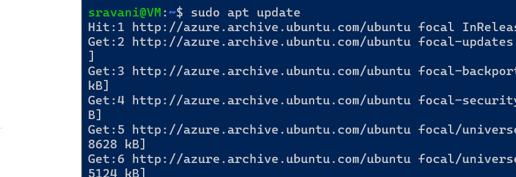
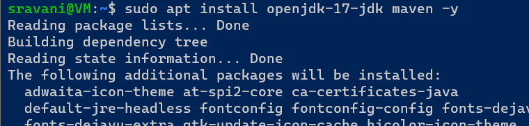
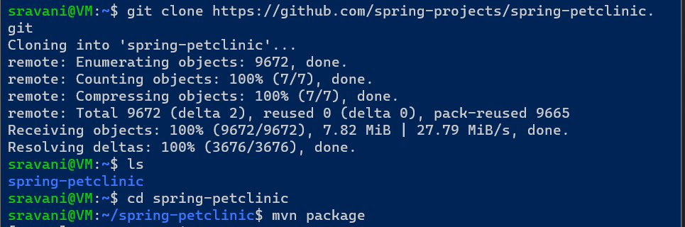
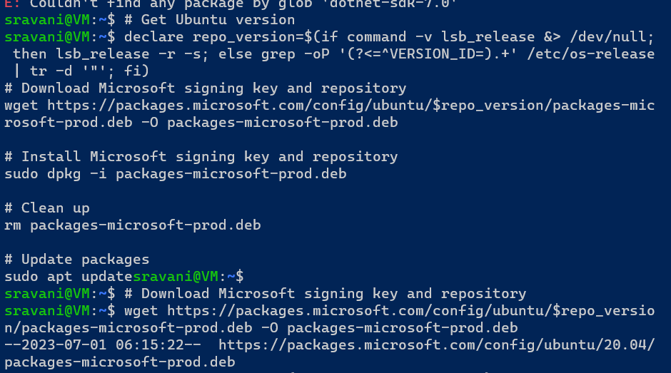
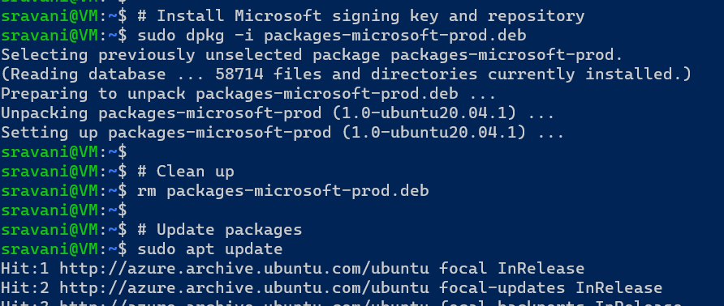

* to write a pipeline for spring petclinic in git
--- 
git clone
branch: main
mvn package

```yaml
---
triggers:
  - main
tasks:
  - name: build package
    mvn@3:
      goal: package
      testResults: '**/*.xml'
```
* .net framework versions:
    * .net 2,3,4 (Windows)
    * .net 5 + (Linux)
        * .net core
        * aspnet core
* The order is like this [restore, build, publish]
* Build the nopCommerce by using .netcore 7 software
* Manual steps
---
dotnet --version
sudo apt-get update (update the packages and install dotnet)
sudo apt-get install -y dotnet-sdk-7.0
dotnet --version
dotnet --help
dotnet build --help

---
* build steps
---
git clone <gitcode>
cd nopCommerce
dotnet build src/NopCommerce.sln
dotnet --list-sdks
cd src
dotnet build NopCommerce.sln
dotnet restore NopCommerce.sln
cd ..
git checkout master
dotnet restore NopCommerce.sln
dotnet build NopCommerce.sln
dotnet test

---
#### Azure DevOps
* Azure DevOps offers services to manage whole project
    * Project Management
        * Planning
            * Agile Boards:
                * An agile board is the visual 
                representation of an agile development process. The board lets you view the current status of each task, group related tasks, estimate your efforts, and track the progress toward completion for each task. The columns on the board represent the development cycle.
            * Issue Tracker:
                * BuildMaster is designed to continuously deliver your applications and components from source code to production, helping all stakeholders track changes to each release.
        * Execution
            * Wiki Pages:
                * Azure DevOps Wiki is a documentation solution within the Azure DevOps Suite.
            * Test Management:
                * Azure Test Plans is a test management module within Azure DevOps that lets users manage test plans, test suites, and test cases for everyone in the software development process.
    * DevOps:
        * VCS:
            * Azure Source Repos
                * Git
                * TFVC (Team Foundation Version Control):
                    * Version control systems consist of software that helps you track changes you make in your code over time.
        * Pipelines:
            * Build Pipelines
            * Release Pipelines
        * Artifacts:
            * Azure Artifacts enables developers to share their code efficiently and manage all their packages from one place.
* Azure DevOps can be used by two ways
    * Self-Hosted 
    * Cloud Hosted
* Azure DevOps Services: Cloud Hosted Version of Azure DevOps
##### YAML [yet another markup language]
* YAML is a data represntation language.
* YAML is name value pair collection
* YAML represents name value pair as <name>: <value>
* Names generally are strings/text and value can be of any type.
* Types:
    * Simple
        * Text/String
        * number
        * boolean
    * Complex
        * list
        * object/map
* Generally yaml used for some configuration purposes will have predefined structure/schema
#### Azure DevOps Pipeline
* Azure DevOps Pipelines are expressed in yaml formats in git repositories generally with name <azure-pipelines.yaml>
* Pipeline:
    * Where should it execute? => Agents
    * When should it run => Trigger
    * What should happend when pipeline executes
        * Stages
        * Jobs
        * Steps
* When pipeline is executed it is execute with code from version control already cloned and in the branch specified
###### Agents in Azure DevOps Pipeline
* Azure DevOps Pipelines have two types of Agents
    * Microsoft hosted Agents
        * Size is always fixed Standard_D2S i.e. 2 vcpu's 8 GB RAM
        * When to use:
            * Build/Deploy uses standard tools/softwares and if the configuration required matches the above statement
            * No/Little configuration is what you like in CI/CD pipelines for executions
* Self Hosted Agents
    * You need to configure agent to connect to azure devops
* Exercise: Setting up agent to build jdk 17 and maven based softwares
* Create a linux vm
* install jdk 17 and maven
```
sudo apt update 
sudo apt install openjdk-17-jdk maven -y
```
* Now we create agent pool
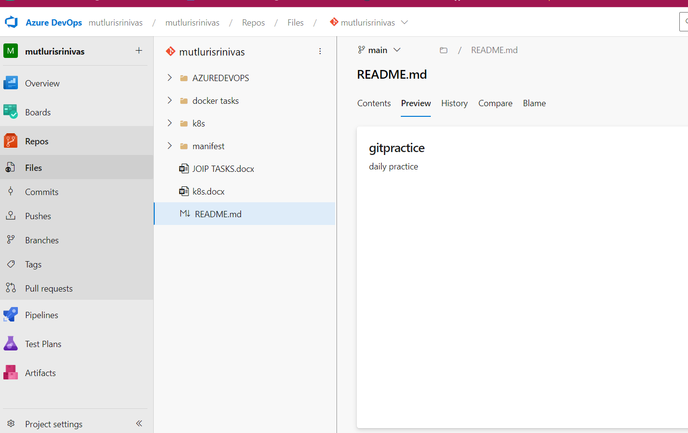


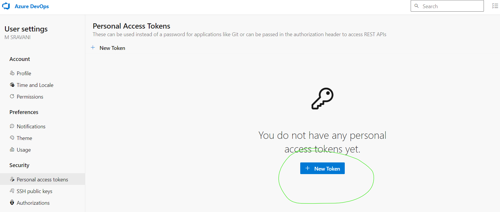
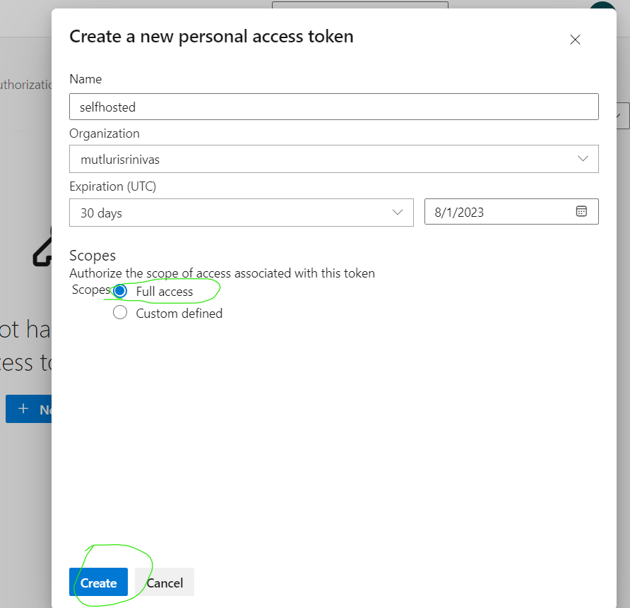
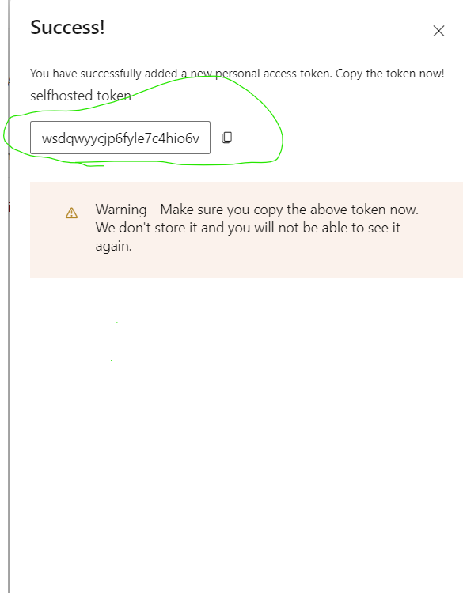
* Copy and save this token on notpad once it close then we regenrate only we did not get this token again.

* Now select the token we get the options
    * Revoke == delete
    * Edit == If chages are there
    * Regenrate == to get the token
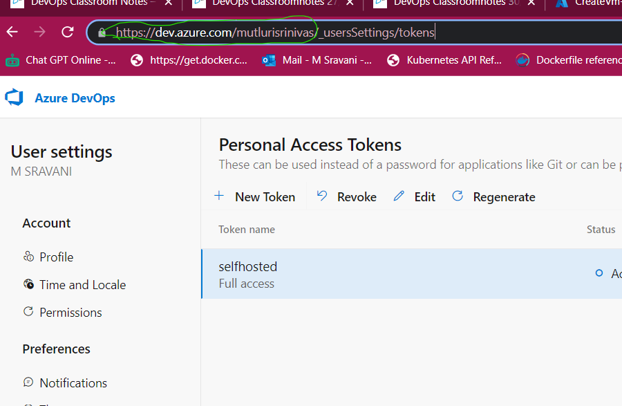
* get the url of our organization this is also copy and save the notepad. We will use again.
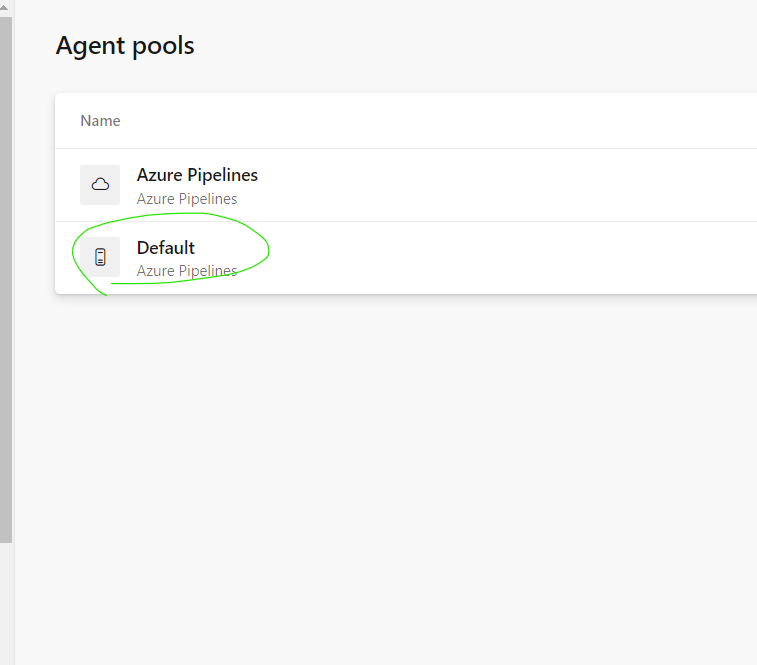
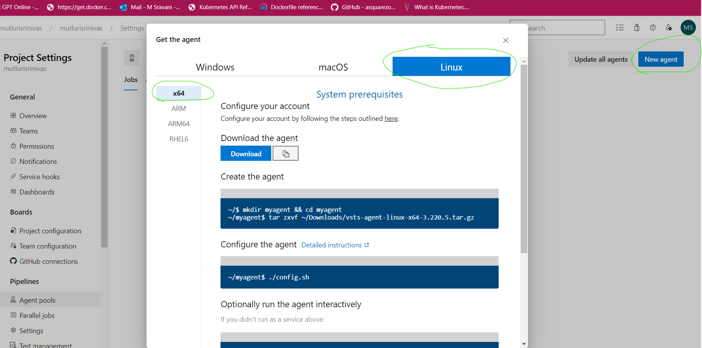
* We create linux machine so we select the only this option only. copy and paste the download code on VM.
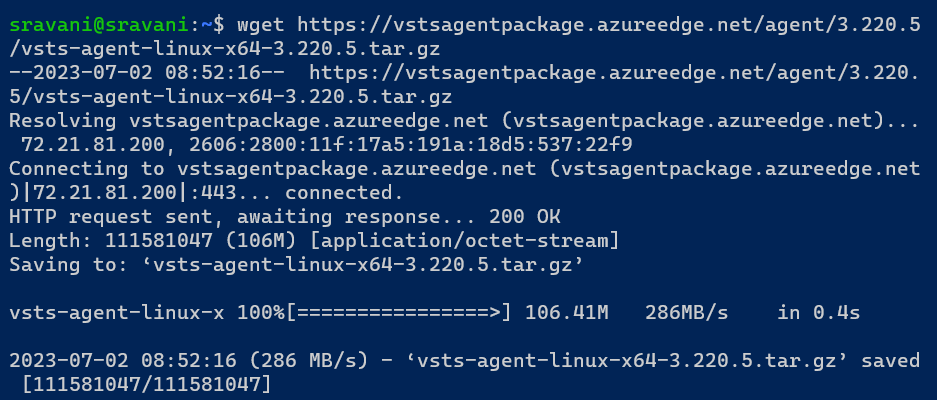


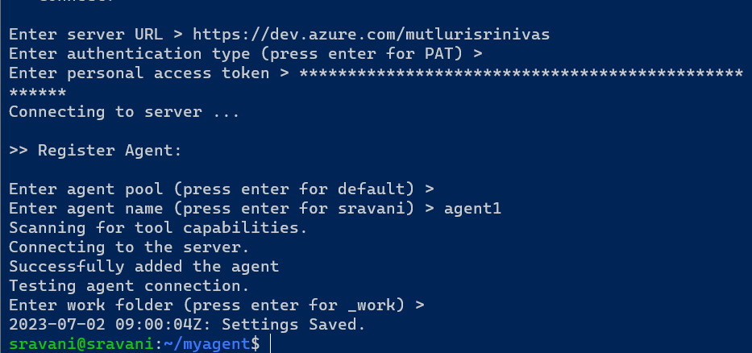
* Here the url and token used.

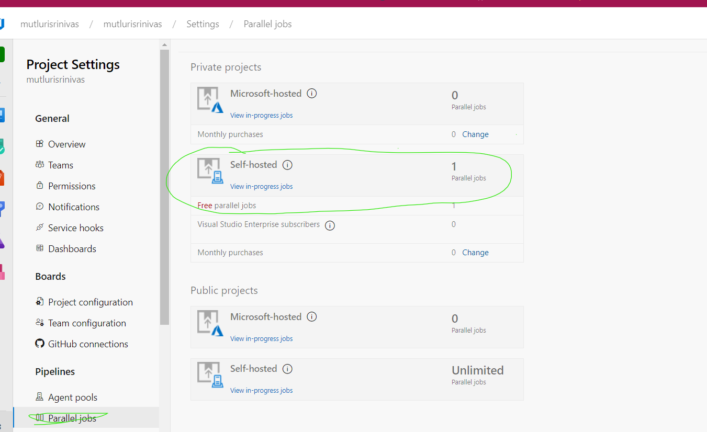

* Build a pipeline for maven package
```yaml
---
trigger: 
  - master

pool: ubuntu-latest

stages:
  - stage: stage1
    displayName: FIRST stage
    jobs:
      - job: Buildcode
        displayName: Build MAVEN
        steps:
          - task: Maven@3
            inputs:
              mavenPOMFile: 'pom.xml'
              goal: 'package'
              publishJUnitResults: true
              testResultsFiles: '**/surefire-reports/TEST-*.xml'
              javaHomeOption: 'JDKVersion'
              jdkVersionOption: 'default'
              jdkArchitectureOption: 'x64'
              mavenVersionOption: 'Default'
```
* Build a pipeline for Docker
```yaml
---
trigger:
  - master
  
pool: 
  vmImage: ubuntu-latest 
stages:
  - stage: Build
    displayName: Build code
    jobs:
      - job: buildcode
        displayName: Build code
        steps:
          - task: Docker@2
            inputs:
              containerRegistry: dockerRegistryServiceConnection
              command: 'buildAndPush'
              Dockerfile: '**/Dockerfile'
              buildContext: '**'
              addPipelineData: true
              addBaseImageData: true
```
* Pipeline for job
```yaml
---
trigger:
  - master
pool: ubuntu-latest
jobs:
  - deployment: Deploycode
    displayName: Deploy code
    strategy:
      runOnce:
        preDeploy: 
          steps: 
            - task: Maven@4
              inputs:
                mavenPOMFile: 'pom.xml'
                goal: 'package'
                publishJUnitResults: true
                testResultsFiles: '**/surefire-reports/TEST-*.xml'
                javaHomeOption: 'JDKVersion'
                jdkVersionOption: 'default'
          steps:
            - task: MSBuild@1
              inputs:
                solution: '**/*.sln'
                msbuildLocationMethod: 'version'
                msbuildVersion: 'latest'                
```
* Pipeline for nopcommerce
```yaml
trigger:
  - master
pool: 
  vmImage: ubuntu-latest
steps: 
  - task: DotNetCoreCLI@2
    inputs:
      command: 'build'
      project: src/NopCommerce.sln
  - task: DotNetCoreCLI@2
    inputs:
      command: 'restore'
      project: src/NopCommerce.sln
```
* Pipeline for nopcommerce
```yaml
---
trigger:
  - master
pool: Default
stages:
  - stage: buildcode
    displayName: Build Code
    jobs: 
      - job: buildjob
        displayName: Build job
        steps:
          - task: DotNetCoreCLI@2
            inputs: 
              command: 'build'
              projects: src/NopCommerce.sln
          - task: DotNetCoreCLI@2
            inputs: 
              command: 'restore'
              projects: src/NopCommerce.sln
```
* Gameoflife
```yaml
---
trigger:
  - main
pool: 
  vmImage: ubuntu-22.04
jobs:
  - job: buildgameoflife
    displayName: Build game-of-life
  steps:
    - task: Maven@4
      inputs: 
        mavenPOMFile: 'pom.xml'
        goal: 'package'
        publishJUnitResults: true
        testResultsFiles: '**/surefire-reports/TEST-*.xml'
        javaHomeOption: 'JDKVersion'
        jdkVersionOption: '1.8'
        mavenVersionOption: 'Default'
    - task: CopyFiles@2
      inputs:
        Contents: '**/target/gameoflife.war'
        TargetFolder: $(Build.ArtifactStagingDirectory)
    - task: PublishBuildArtifacts@1
      inputs:
        PathtoPublish: '$(Build.ArtifactStagingDirectory)'
        ArtifactName: 'GameOfLifeArtifacts'
        publishLocation: 'Container'
```
* 
```yaml
---
trigger:
  - main
pool:
  vmImage: ubuntu-20.04
variables:
  - goals: 'package'
parameters:
  - name: mavengoal
    displayName: Maven Goal
    type: string
    default: parameters
    values: 
      - package
      - ubuntu-20.04
      - install
jobs:
  - job: buildgameoflifepackage
    displayName: Build game-of-life package
    steps:
      - task: Maven@4
        inputs:
          mavenPOMFile: 'pom.xml'
          goals: '${{ parameters.mavenGoal }}'
          publishJUnitResults: true
          testResultsFiles: '**/surefire-reports/TEST-*.xml'
          javaHomeOption: 'JDKVersion'
          jdkVersionOption: '1.8'
      - task: CopyPublishBuildArtifacts@1
        inputs:
          Contents: '**/target/gameoflife.war'
          ArtifactName: 'GameOfLifeArtifacts'
          ArtifactType: 'Container'
      - task: PublishBuildArtifacts@1
        inputs:
          PathtoPublish: '$(Build.ArtifactStagingDirectory)'
          ArtifactName: 'GameOfLifeArtifacts'
          publishLocation: 'Container'
```
* spring pet clnic
```yaml
---
trigger:
  - main
pool: Default
variables: 
  - name: package
parameters: 
  - name: mavenGoal
    displayName: Maven goal
    type: string
jobs:
  - job: buildspringpetclinic
    displayName: Build spring-petclinic
    steps: 
      - task: Maven@3
        inputs:
          mavenPOMFile: 'pom.xml'
          goal: '${{ parameters.mavenGoal }}'
          publishJUnitResults: true
          testResultsFiles: '**/surefire-reports/TEST-*.xml'
          
      - task: CopyFiles@2
        inputs:
          Contents: '**/target/spring-petclinic*.jar'
          TargetFolder: $(Build.ArtifactStagingDirectory)
          - task: PublishBuildArtifacts@1
            inputs:
              PathtoPublish: '$(Build.ArtifactStagingDirectory)'
              ArtifactName: 'SpringPetclinicArtifacts'
              publishLocation: 'Container'
```


```yaml
---
trigger:
  - master
pool: 
  name: Azure Pipelines
  VmImage: ubuntu-20.04
variables:
  name: package
parameters:
  - name: dotnetgoal
    displayName: Dotnet Goal
    type: string
    default: dotnetgoal
    values: 
      - package
      - Default
      - install 

stages:
  - stage: buildcode
    displayName: Build Code
    jobs: 
      - job: buildjob
        displayName: Build job
        steps:
          - task: DotNetCoreCLI@2
            inputs: 
              command: 'build'
              projects: src/NopCommerce.sln
          - task: DotNetCoreCLI@2
            inputs: 
              command: 'restore'
              projects: src/NopCommerce.sln
          - task: CopyFiles@2
            inputs:
              Contents: '**/target/Nop.*.Tests.dll'
              TargetFolder: $(Build.ArtifactStagingDirectory)
          - task: PublishBuildArtifacts@1
            inputs:
              PathtoPublish: '$(Build.ArtifactStagingDirectory)'
              ArtifactName: 'Nop_Artifacts'
              publishLocation: 'Container'
```


ghuzs4bbneo6xrawlfq6rsigmmyjjrp7ca2xws5pg4pepnwr3nsa
https://dev.azure.com/mutlurisrinivas


wget https://vstsagentpackage.azureedge.net/agent/3.220.5/vsts-agent-linux-x64-3.220.5.tar.gz
mkdir agent
cd agent
tar xvzf ~/vsts-agent-linux-x64-3.220.5.tar.gz
./config.sh
./run.sh


* In azure devops Variables is called predefined variables.
* Expressions are used for condition statement
* 


gameoflife pipeline microsoft hosted
using schema
pipeline is a collection jobs


```yaml
---
trigger:
  - master

jobs:
  - job: buildjob
    displayName: Build and Package Game of life
    pool: ubuntu-22.04
    steps:
      - task: Maven@3
        inputs:
          mavenPOMFile: 'pom.xml'
          goals: 'package'
          publishJUnitResults: true
          testResultsFiles: '**/surefire-reports/TEST-*.xml'
          javaHomeOption: 'JDKVersion'
          jdkVersionOption: '1.8'
          mavenVersionOption: 'Default'
```
