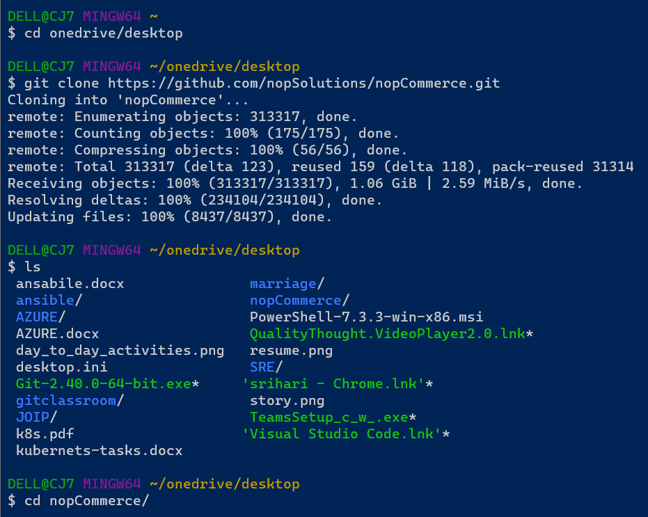

# AZURE DevOps
* Azure DevOps is a pipeline tool. In this
    * Countinous Intigration
    * Countinous Delivery
    * Countinous Deployment
* Thats why it is also called as CI/CD pipelines.
## CI/CD Pipelines
#### Countinous Intigration:
* Continuous integration (CI) is the process of automatically building and testing code every time a team member commits code changes to version control. A code commit to the main or trunk branch of a shared repository triggers the automated build system to build, test, and validate the full branch.
#### Countinous Deployment:
* Continuous deployment (the other possible "CD") can refer to automatically releasing a developer’s changes from the repository to production, where it is usable by customers. It addresses the problem of overloading operations teams with manual processes that slow down app delivery.

### Big Bang integration
* Consider a case where you are working for vintage systems where we are developing ecommerce application in Waterfall model.
* Application is in layered architecture
    * Presentation Layer
        * Web server
    * Business Layer
        * ECommerce server
    * Data Layer
        * image or video server
        * Data server
* Big Bang integrations are error prone, so best solution would be continuos integration (CI).
* The Goal of CI is to inform dev teams about the failures of integration.
* To perform CI different tools started like cruise control and hudson/jenkins
* Need for automated tests/unit tests started at this point.
##### Agile way of Software Development
* Agile had added smaller and frequent releases, this needs more aggressive automations than CI.
###### Expectation:
* Automated Pipeline which when developer pushes changes
    * Build/Package code
    * Code Quality and Security Issues
* Automate test executions with System, Performance, Reliablity, Security
* Report of the Quality of work done yesterday
* Customer and Internal Releases every 2 weeks
###### Plan ahead
    * Git Basics
    * YAML
    * Azure DevOPs
        * Boards
        * Build & Release Pipelines (*)
        * Artifacts
        * Documentation
        * Azure Source Repos
        * ****
##### Code Base: Open Source
    * .net
    * java
    * Workshop:
        * python
        * node js
#### Countinous Delivery:
* Continuous delivery (CD) is the process of automating build, test, configuration, and deployment from a build to a production environment. A release pipeline can create multiple testing or staging environments to automate infrastructure creation and deploy new builds.
* This pipeline will be triggered by the changes in the Version Control Systems (VCS).
#### WOW (Ways of Working)
* Figure out the manual steps
* Implement manual steps in Pipeline depending on your ci/cd engine
* Steps for gameoflife
* Softwares requried
    * git
    * jdk 8
    * maven
* Run the game of life manually by using following commands
---
* sudo apt update
* sudo apt install openjdk-8-jdk maven -y
* java -version
* mvn -version
* git clone https://github.com/wakaleo/game-of-life.git
* cd game-of-life
* mvn package
* cd gameoflife-web/target
* ls
---
* Pipeline in Jenkins
---
pipeline {
    agent any
    stages {
        stage ('vcs') {
            steps {
                git 'https://github.com/wakaleo/game-of-life.git'
            }
        }
        stage ('build') {
            steps {
                sh 'mvn package'
            }
        }
    }
}

---
* Pipeline in Azure DevOps
---
steps:
- task: Maven@4
  inputs:
    mavenPomFile: 'pom.xml'
    goals: 'package'
---
* Pipeline in git
---
run:
  script:
    - mvn package
    # run the command here
  artifacts:
    paths:
      - gameoflife-web/target/*.war

---
* Version control system is GIT
### Git
* Git is a Distributed Version Control System
* Git is Hosted by many providers
    * GitHub
    * Azure Source Repos
    * Code Commit
    * Bit Bucket
    * Git Lab
* The storage location is called repositry.
### Git – Basics
* Scope of the current discussion would be on how to submit the changes to the Git Repository and how to get latest changes from git repository
###### Workflow
* Setting up a GitHub Account
* Setting up a user details and credentials (key based credentials)
* Creating a Git Repository, Adding code/docs submitting to the repository
###### System Setup:
    * Softwares:
        * Terminal (Windows)
        * Git
        * Chocolatey (Windows)
        * home brew Mac
        * Visual Studio Code
### Git Workflow
* Git Remote Repositories are hosted by GitHub/GitLab/Azure Source Repos etc
* If we don’t have the Code in local system, then we clone the code to create local repo
* Once we have local repo, to get latest changes we use pull
* We add the changes to the staging area using add and commit the changes to local repo using commit and sync the changes from local to remote repo using push command
---
* git status
* git add .
* git commit -m "added changes"
* git push
* git pull
---
* Above commands are used regulary.
#### Branches in Git
* Git allows us to work parallely for different use cases
    * multiple versions of same application
    * multiple customers for same application
* HEAD is a pointer which generally points to a branch
HEAD can be moved from one branch to other using a command called as checkout
* The moving HEAD is called checkout
* Now excuite the chrckout command by using the following commands
---
* cd onedrive/desktop
* cd /c/temp
* ls
* git clone <git code>
* ls
* cd nopcommerce
* git branch
* git branch -r
* git checkout master
* git branch
* git branch -r
* git remote add azure <git code> git@github.com:nopSolutions/nopCommerce.git
* git pull azure master
* git branch -r
---
* By using Checkout command we can change one branch to another branch.

* Things to digest
    * default branch: master
    * default remote: origin
    * remote branch: name of remote/name of branch
##### Building and Packaging the code
* Building the code and packaging the code to the suitable format for end deployment is very technology specific i.e. it is different depending on programming languages.
* Programming Languages can be categorized into 3 formats
    * Compiler based:
        * A compiler is a special program that translates a programming language's source code into machine code, bytecode or another programming language. The source code is typically written in a high-level, human-readable language such as Java or C++.
    * Interpreter based
        * An Interpreter directly executes instructions written in a programming or scripting language without previously converting them to an object code or machine code. Examples of interpreted languages are Perl, Python and Matlab.
    * Hybrid
        * Hybrid is like a compiler but not compiler. Hybrid is like a interpreter but not interpreter.
* 

###### Dependecny Managment
* To develop any application , there will be lots of dependencies on other libraries/sdks
* sdks is some of the reusual code already written
* before building/packaging we need to download these dependencies
    * nodejs npm
    * python pip
    * .net nuget
    * java mvn
###### Test Executions
* We would be running
    * unit tests (test code by writing code) it is generlly wriiten by developers
    * integration tests
        * unit test
        * ui test
        * api test
    * Functional tests
        * ui tests (simulate user) some user is track this => selenium, cypress, qtp…
        * api tests (postman, rest assured) if ui test not there then we use api test.
    * Performance tests:
        * load testing harness (jmeter, load runner) 
* What we should know for ci/cd
    * command to invoke tests
    * where will be test results
    * converting test results to some common formats (junit xml)
###### Java Based Applications
* To build Java Based applications, we have many tools
    * ANT
    * Maven
    * Gradle
* Maven is populer in java based application.
* In this case we will be using a maven based java application
    * JDK = 17
    * MVN 3 +
    * prject: springpetclinic
* This will be excuted manually in linux machine by using the following commands.
---
* sudo apt update
* sudo apt install openjdk-17-jdk maven -y
* git clone https://github.com/spring-projects/spring-petclinic.git
* cd spring-petclinic
* mvn package  # creates package, run unit tests
---
* to write a pipeline for spring petclinic in git
--- 
git clone
branch: main
mvn package

---
triggers:
  - main
tasks:
  - name: build package
    mvn@3:
      goal: package
      testResults: '**/*.xml'

---