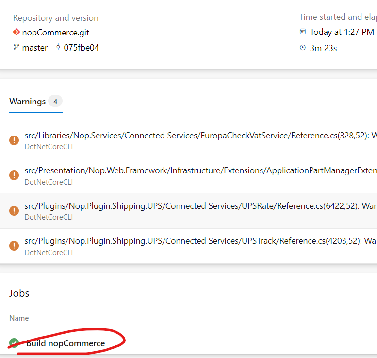

### create self host agent, build and deploye the game of life
* To import the game of life code from git repositry. Then crate a token and self hosted agent. Build the pipeline by the following images.


* Copy and save this token on notpad once it close then we regenrate only we did not get this token again.


* Now select the token we get the options
    * Revoke == delete
    * Edit == If chages are there
    * Regenrate == to get the token


* get the url of our organization this is also copy and save the notepad. We will use again.


* We create linux machine so we select the only this option only. copy and paste the download code on VM.


* Here the url and token used.


```yaml
---
trigger:
  - main
pool:
  name: Default

parameters:
  - name: mavengoal
    displayName: Maven Goal
    type: string
    default: mavengoal
    values: 
      - package
      - Default
      - install
jobs:
  - job: buildgameoflifepackage
    displayName: Build game-of-life package
    steps:
      - task: Maven@3
        inputs:
          mavenPOMFile: 'pom.xml'
          goals: ${{ parameters.mavenGoal }}
          publishJUnitResults: true
          testResultsFiles: '**/surefire-reports/TEST-*.xml'
      - task: CopyPublishBuildArtifacts@1
        inputs:
          Contents: '**/target/gameoflife.war'
          ArtifactName: 'GameOfLifeArtifacts'
          ArtifactType: 'Container'
      - task: PublishBuildArtifacts@1
        inputs:
          PathtoPublish: '$(Build.ArtifactStagingDirectory)'
          ArtifactName: 'GameOfLifeArtifacts'
          publishLocation: 'Container'
```


### create microsoft host agent, build and deploye the game of life
* To  import the code and directly run the code on microsoft hosted agent by using the bellow yaml file.
* Build the pipeline by the following images.


* Yaml file for the gameoflife
```yaml
---
trigger:
  - main
pool:
  name: Azure Pipelines
  VmImage: ubuntu-20.04

parameters:
  - name: mavengoal
    displayName: Maven Goal
    type: string
    default: mavengoal
    values: 
      - package
      - Default
      - install
jobs:
  - job: buildgameoflifepackage
    displayName: Build game-of-life package
    steps:
      - task: Maven@3
        inputs:
          mavenPOMFile: 'pom.xml'
          goals: ${{ parameters.mavenGoal }}
          publishJUnitResults: true
          testResultsFiles: '**/surefire-reports/TEST-*.xml'
          javaHomeOption: 'JDKVersion'
          jdkVersionOption: '1.8'
      - task: CopyPublishBuildArtifacts@1
        inputs:
          Contents: '**/target/gameoflife.war'
          ArtifactName: 'GameOfLifeArtifacts'
          ArtifactType: 'Container'
      - task: PublishBuildArtifacts@1
        inputs:
          PathtoPublish: '$(Build.ArtifactStagingDirectory)'
          ArtifactName: 'GameOfLifeArtifacts'
          publishLocation: 'Container'
```

### create microsoft host agent, build and deploye the nopcommerce
* To  import the code and directly run the code on microsoft hosted agent by using the bellow yaml file.
* Build the pipeline by the following images.




```yaml
---
trigger:
  - master
pool:
  name: Azure Pipelines
  VmImage: ubuntu-20.04
variables:
  name: package
parameters:
  - name: dotnetgoal
    displayName: Dotnet Goal
    type: string
    default: dotnetgoal
    values: 
      - package
      - Default
      - install 

stages:
  - stage: buildnopcommerce
    displayName: Build nopCommerce
    jobs:
      - job: buildnopcommerce
        displayName: Build nopCommerce
        steps: 
          - task: DotNetCoreCLI@2
            inputs: 
              command: 'build'
              projects: src/NopCommerce.sln
          - task: DotNetCoreCLI@2
            inputs: 
              command: 'restore'
              projects: src/NopCommerce.sln
```


### create microsoft host agent, build and deploye the Spring Petclinic
* To  import the code and directly run the code on microsoft hosted agent by using the bellow yaml file.
* Build the pipeline by the following images.


```yaml
---
trigger:
  - main
pool: Default
variables: 
  - name: package
parameters: 
  - name: mavenGoal
    displayName: Maven goal
    type: string
jobs:
  - job: buildspringpetclinic
    displayName: Build spring-petclinic
    steps: 
      - task: Maven@3
        inputs:
          mavenPOMFile: 'pom.xml'
          goal: '${{ parameters.mavenGoal }}'
          publishJUnitResults: true
          testResultsFiles: '**/surefire-reports/TEST-*.xml'
          
      - task: CopyFiles@2
        inputs:
          Contents: '**/target/spring-petclinic*.jar'
          TargetFolder: $(Build.ArtifactStagingDirectory)
          - task: PublishBuildArtifacts@1
            inputs:
              PathtoPublish: '$(Build.ArtifactStagingDirectory)'
              ArtifactName: 'SpringPetclinicArtifacts'
              publishLocation: 'Container'
```
##### Concution:
* Done the build and deploy the 
  * gameoflife
  * nopcommerce
  * springpetclinic
  
