#### DAY1
# Run hello-world docker container and observe the container status
* Create a container by using following commands
---
  * docker container hello-world
  * docker container ls
  * docker info
---
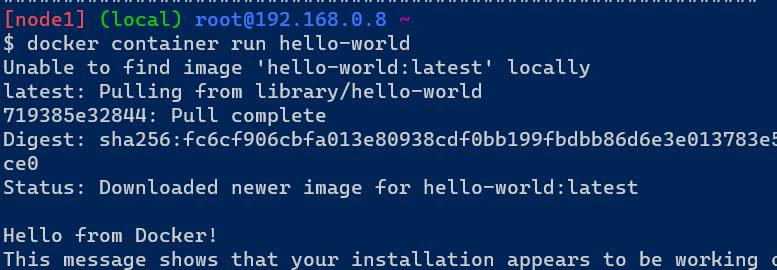


### Check the docker images and write down the size of hello-world image
* To check the image size use the following command
---
  * docker image ls
---


### Run the nginx container with name as nginx1 and expose it on 8080 port on docker host
* Create a container by using following commands
---
  * docker container run -d -p 8080:80 --name nginx1 nginx
---
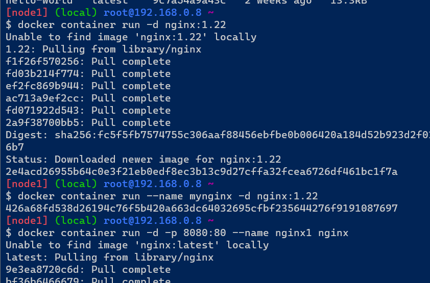


### Explain docker container lifecycle
* Docker lifecycle has 6 states they are
  *  1.Create
  *  2.Run
  *  3.Stop
  *  4.Pause
  *  5.Unpause
  *  6.Delete
* Above states explained with example below commands
---
  * docker container run -d -p --name sravani nginx
  * docker container stop sravani
  * docker container start sravani
  * docker container pause sravani
  * docker container unpause sravani
  * docker container rm sravani
---

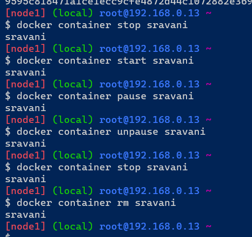

### Explain what happens when you run the docker container
* The docker run command creates running container by using docker images and can run commands inside them. When using the docker run command, a container can run a action.
* Show all the states of docker container on nginx based container


### Explain the Docker architecture
* Docker architecture. Docker uses a client-server architecture. The Docker client talks to the Docker daemon, which does the heavy lifting of building, running, and distributing your Docker containers. The Docker client and daemon can run on the same system, or you can connect a Docker client to a remote Docker daemon.
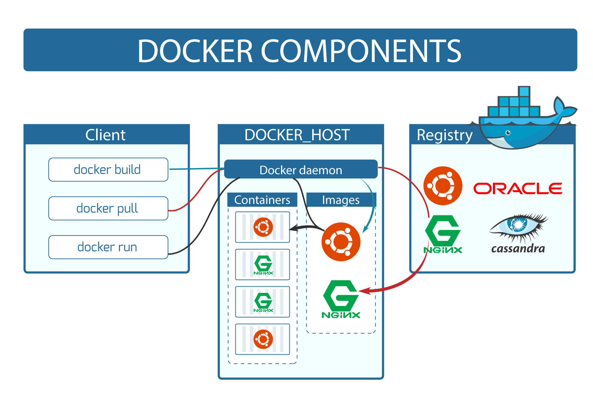

#### DAY2
### Write a Docker file for NodeJS application – expressjs
* Dockerfile
---
* FROM node:16-alpine
* RUN apk add --update
* RUN apk add git
* RUN git clone https://github.com/expressjs/express.git
* RUN cd express && \
      npm install express && \
      npm install -g express-generator@4 && \
      express /tmp/foo
* WORKDIR /tmp/foo
* RUN npm install
* EXPOSE 3000
* CMD ["npm", "start"]
---
* docker image build -t node:16-alpine .
* docker container run -d --name sravani -P node:16-alpine
---


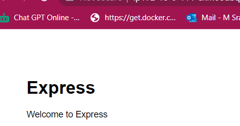

#### DAY3
### create a MySQL dB container from official MySQL image
* Select a image to run container from docker hub and run the container by using following commands.
---
* docker container run -d --name mysqldb -e MYSQL_ROOT_PASSWORD=srinivas -e MYSQL_DATABASE=employees -e MYSQL_USER=sravani -e MYSQL_PASSWORD=mutluri -P mysql:8
* docker container ls
---


### login into SQL container and create a table
* To create a table we will enter inside the container and check the databases by using following commands
---
* docker container exec -it mysqldb mysql --password=srinivas
* show databases;
* use employees;
* CREATE TABLE employees ( PersonID int, LastName varchar(255), FirstName varchar(255), Address varchar(255), City varchar(255) );
* Insert into employees Values (1,'sravani','mutluri', 'ameerpet', 'hyd');
* Insert into employees Values (2,'srinivas','mutluri', 'mallavalli', 'nud');
* select * from employees;
---


## Try to create a persisted volume in MySQL container and mount that to other

---
docker container run -d --name sravani -v mysqldb:/var/lib/mysql -P -e MYSQL_ROOT_PASSWORD=rootroot -e MYSQL_DATABASE=students -e MYSQL-USER=sravani -e MYSQL_PASSWORD=rootroot mysql
* docker container run -d --name sravani --mount "source=sravani,target=/var/lib/mysql,type=volume" -P -e MYSQL_ROOT_PASSWORD=rootroot -e MYSQL_DATABASE=students -e MYSQL-USER=sravani -e MYSQL_PASSWORD=rootroot mysql
---


#### DAY4
### Create an alpine container in interactive mode and install python
* Manual step
* Create a container by using following commands
* ---
* <docker container run -it --name sravani alpine:latest>
* <apk --update upgrade>
* apk add python3
* <python3 --version>
* ---
* 
* 
* By using Dockerfile and create container
* ---
* FROM alpine:latest
  LABEL author="sravani" organization="techinfo" project="python"
  RUN apk --update upgrade
  RUN apk add python3
  CMD ["python3 --version"]
* ---
* Now build the image by using following command
* ---
* <docker image build -t python .>
* <docker image ls>
* ---
* 
* 

### Create a ubuntu container with sleep 1d and then login using exec and install python
* login to docker playground in terminal and create container by using following commands.
* ---
* docker container run -d --name py -P ubuntu:20.04 sleep 1d
* docker container exec -it py /bin/bash
* apt update
* apt install python3 -y
* python3 --version
* ---
* 
* 
* 
* 

### Create a postgres container with username panoramic and password as trekking. Try logging in and show the databases (query for psql)
* login to docker playground in terminal and create postgres by using following commands
* ---
* docker container run -d --name database -e POSTGRES_USER=panoramic -e POSTGRES_PASSWORD=trekking -e POSTGRES_DB=psqldata -P postgres:15
* docker container exec -it database postgres --password=trekking
* docker exec -it database /bin/bash
* psql --help
* ---
* 
* 
* To create table 
* ---
* psql -U panoramic -W trekking -d psqldata
* CREATE TABLE Persons (
    PersonID int,
    LastName varchar(295),
    FirstName varchar(295),
    Address varchar(295),
    City varchar(295)
);
* Insert into Persons Values (1, 'sravani', 'mutluri', 'ameerpet', 'hyd');
* Insert into Persons Values (2, 'srinivas', 'mutluri', 'ameerpet', 'hyd'); 
* SELECT * from Persons;
* ---
* 
* 

### Try to create a docker file which runs php info page, use ARG and ENV wherever appropriate on
# apache server
* login to docker playground in terminal and create a dockerfile for apache server
* ---
* FROM ubuntu:22.04
  LABEL author="sravani" organization="QT tech" project="apache"
  ARG DEBIAN_FRONTEND=noninteractive
  RUN apt update && apt install apache2 -y
  RUN apt install php libapache2-mod-php -y
  RUN echo "<?php phpinfo() ?>" >> /var/www/html/info.php
  EXPOSE 80
  CMD ["apache2ctl","-D","FOREGROUND"] 
* ---
* After creating dockerfile to build the image use the following commands.
* ---
* docker image build -t apache .
* docker container run --name php -d -P apache
* docker container ls
* ---
* 
* 
* Now we observe the port number and open that port.
* 

# nginx server
* login to docker playground in terminal and create a dockerfile for nginx server
* ---
* FROM ubuntu:22.04
  LABEL author="sravani" organization="techinfo" project="nginx"
  ARG DEBIAN_FRONTEND=noninteractive
  RUN apt update && apt upgrade -y
  RUN apt install nginx -y
  RUN apt install php php-fpm -y
  RUN rm -rf /var/lib/apt/lists/
  COPY nginx.conf /etc/nginx/sites-available/default
  RUN chmod -R 777 /var/www/html
  RUN echo "<?php phpinfo() ?>" >> /var/www/html/info.php
  EXPOSE 80
  ENTRYPOINT ["/bin/bash","-c","service php-fpm start && nginx -g 'daemon off;'"]
  CMD ["nginx","-g","daemon off;"]
* ```
* After creating dockerfile to build the image use the following commands.
* ---
* docker image build -t nginx .
* docker container run --name php -d -P nginx
* docker container ls
* ---
* 
* 

### Create a Jenkins image by creating an own docker file
* login to docker playground in terminal and create a dockerfile for jenkins server
* ---
* FROM ubuntu:22.04
  LABEL author="sravani" organization="techinfo" project="jenkins"
  RUN apt update && apt install openjdk-11-jdk maven curl -y
  RUN curl -fsSL https://pkg.jenkins.io/debian-stable/jenkins.io-2023.key | tee \
      /usr/share/keyrings/jenkins-keyring.asc > /dev/null
  RUN echo deb [signed-by=/usr/share/keyrings/jenkins-keyring.asc] \
      https://pkg.jenkins.io/debian-stable binary/ | tee \
      /etc/apt/sources.list.d/jenkins.list > /dev/null
  RUN apt-get update 
  RUN apt-get install jenkins -y
  EXPOSE 8080
  CMD ["/usr/bin/jenkins"]
* ---
* After creating dockerfile to build the image use the following commands.
* ---
* docker image build -t sravani .
* docker container run -d --name sravani -P jenkins/jenkins
* ---
* 
*  

### Create nop commerce and MySQL server and try to make them work by configuring
# nop commerce
* 
---
* FROM mcr.microsoft.com/dotnet/sdk:7.0
  LABEL author="sravani" organization="techinfo" project="nopcommerce"
  ADD https://github.com/nopSolutions/nopCommerce/releases/download/release-4.60.2/nopCommerce_4.60.            2_NoSource_linux_x64.zip /nop/nopCommerce_4.60.2_NoSource_linux_x64.zip
  WORKDIR /nop
  RUN apt update && apt install unzip -y && \
      unzip /nop/nopCommerce_4.60.2_NoSource_linux_x64.zip && \
      mkdir /nop/bin && mkdir /nop/logs
  EXPOSE 5000
  ENV ASPNETCORE_URLS="http://0.0.0.0.0:5000"
  CMD [ "dotnet", "Nop.Web.dll" ]
---
* After creating dockerfile to build the image use the following commands.
---
* docker image build -t nop .
* docker network create -d bridge --subnet "10.0.0.0/24" mysqlnetwork
* docker volume create mysqlvolume
* docker container run --name mynop1 -d -P --network mysqlnetwork -e MYSQL_SERVER=mysqldb nop
* docker container run -d --name hema -e MYSQL_ROOT_PASSWORD=srinivas -e MYSQL_DATABASE=test -e MYSQL_USER=sravani -e MYSQL_PASSWORD=mutluri --network mysqlnetwork -v mysql:/var/lib/mysql mysql:5.6
* docker container ls
---
*  
*  
* 
* 
* 
* 

#### DAY 5
### Multi stage Docker file and push images to azure/aws registries and docker compose file for following applications

## spring pet clinic

* Dockerfile
---
* FROM alpine/git AS vcs
* RUN cd / && git clone https://github.com/spring-projects/spring-petclinic.git && \
    pwd && ls /spring-petclinic

* FROM maven:3-amazoncorretto-17 AS builder
* COPY --from=vcs /spring-petclinic /spring-petclinic
* RUN ls /spring-petclinic
* RUN cd /spring-petclinic && mvn package

* FROM amazoncorretto:17-alpine-jdk
* LABEL author="sravani"
* EXPOSE 8080
* ARG HOME_DIR=/spc
* WORKDIR ${HOME_DIR}
* COPY --from=builder /spring-petclinic/target/spring-*.jar ${HOME_DIR}/spring-petclinic.jar
* EXPOSE 8080
* CMD ["java", "-jar", "spring-petclinic.jar"]
---
* To build and run the docker file by using following commands
---
* docker image build -t spc .
* docker container run --name sravani1 -d -P spc
* docker container ls
---
* 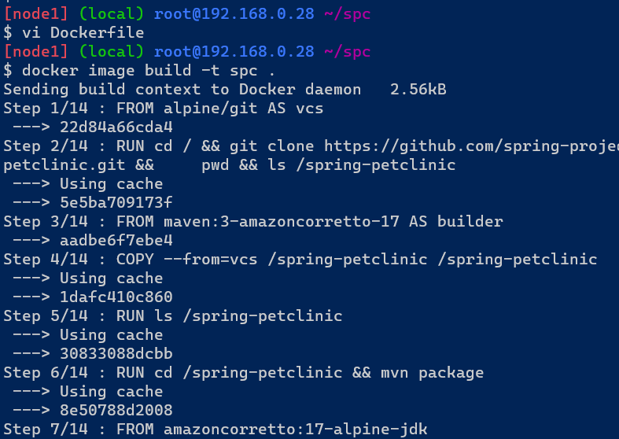
* 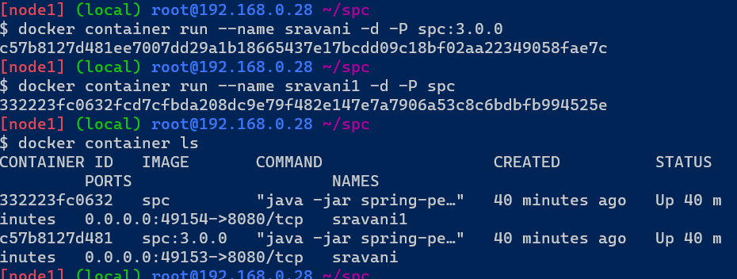
* 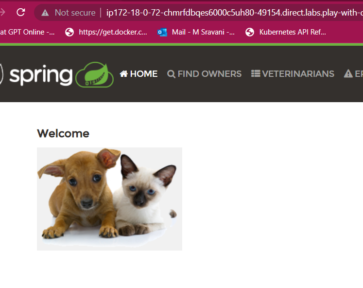

## game of life
* Dockerfile
---
FROM alpine/git AS vcs
RUN cd / && git clone https://github.com/wakaleo/game-of-life.git && \
    pwd && ls /gameoflife

FROM maven:3-amazoncorretto-8 AS builder
COPY --from=vcs /game-of-life /game-of-life
RUN ls /game-of-life
RUN cd /game-of-life && mvn package

FROM tomcat:9-jdk8
LABEL author="sravani"
COPY --from=builder /game-of-life/gameoflife-web/target/*.war /usr/local/tomcat/webapps/gameoflife.war
EXPOSE 8080
---

* To build and run the docker file by using following commands
---
* docker image build -t gol .
* docker container run --name sravani -d -P gol
* docker container ls
---
* 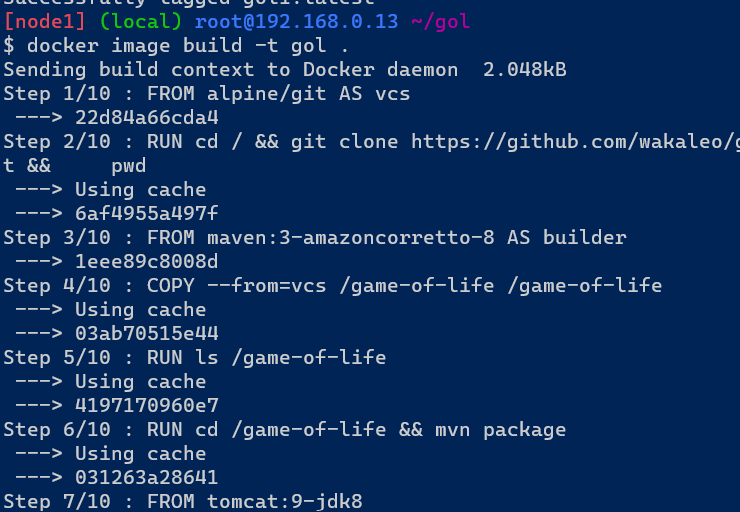
* 
* 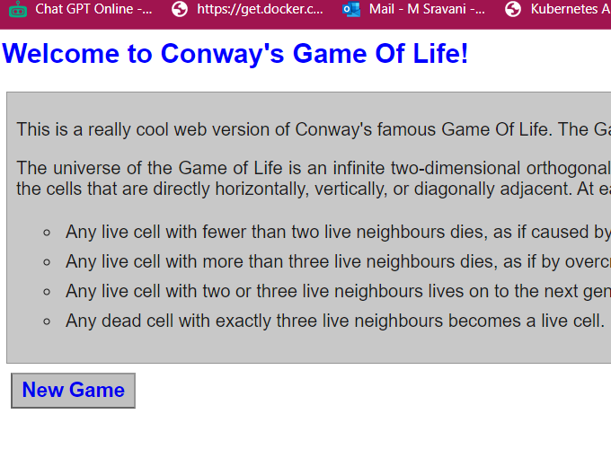

## nopCommerce
* Dockerfile
---
FROM ubuntu:22.04 as nopCommerce
RUN apt update && apt install unzip -y
ARG DOWNLOAD_URL=https://github.com/nopSolutions/nopCommerce/releases/download/release-4.60.2/nopCommerce_4.60.2_NoSource_linux_x64.zip
ADD ${DOWNLOAD_URL} /nopCommerce/nopCommerce_4.60.2_NoSource_linux_x64.zip
RUN cd /nopCommerce && unzip nopCommerce_4.60.2_NoSource_linux_x64.zip && \
mkdir bin logs && rm nopCommerce_4.60.2_NoSource_linux_x64.zip

FROM mcr.microsoft.com/dotnet/sdk:7.0
LABEL author="manu" organization="khaja.tech" project="nop"
ARG DIRECTORY=/nop
WORKDIR ${DIRECTORY}
COPY --from=nopCommerce  /nopCommerce ${DIRECTORY}
EXPOSE 5000
ENV ASNETCORE_URLS="http://0.0.0.0:5000"
CMD ["dotnet","Nop.Web.dll"] 
---
* To build and run the docker file by using following commands
---
* docker image build -t nop .
* docker container run --name sravani -d -P nop
* docker container ls
---
* 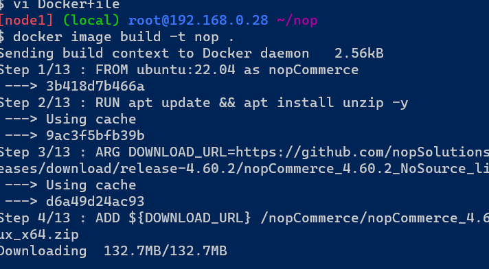
* 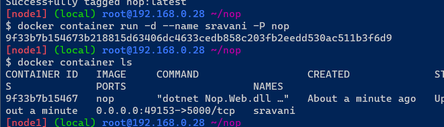
* 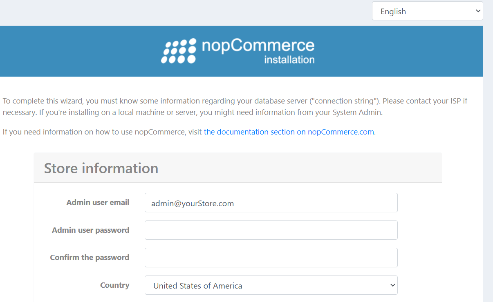

## student courses register
* Dockerfile
---
FROM python:3.7-alpine
LABEL author=KHAJA
LABEL blog=directdevops.blog
ARG HOME_DIR='/studentcourses'
ADD . $HOME_DIR
ENV MYSQL_USERNAME='directdevops'
ENV MYSQL_PASSWORD='directdevops'
ENV MYSQL_SERVER='localhost'
ENV MYSQL_SERVER_PORT='3306'
ENV MYSQL_DATABASE='test'
EXPOSE 8080
WORKDIR $HOME_DIR
RUN pip install -r requirements.txt
ENTRYPOINT ["python", "app.py"]
---
* To build and run the docker file by using following commands
---
* git clone https://github.com/DevProjectsForDevOps/StudentCoursesRestAPI.git
* cd StudentCoursesRestAPI
* docker image build -t studentcourserestservice:1.0 .
* docker container run -d --name mysql -e MYSQL_ROOT_PASSWORD=password -e MYSQL_DATABASE=test -e MYSQL_USER=directdevops -e MYSQL_PASSWORD=directdevops mysql:5.6
* docker inspect mysql | grep IPAddress
* docker container run -d --name mypythonapp -e MYSQL_SERVER=172.17.0.2 -p 8080:8080 studentcourserestservice:1.0
---
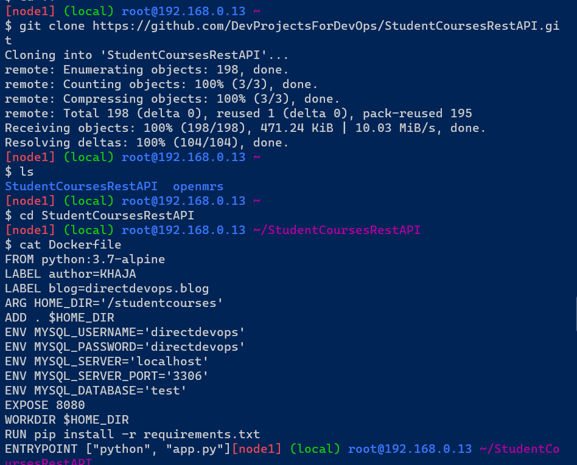
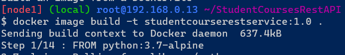
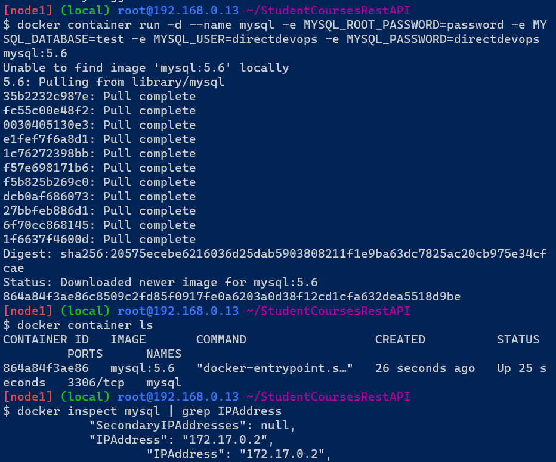
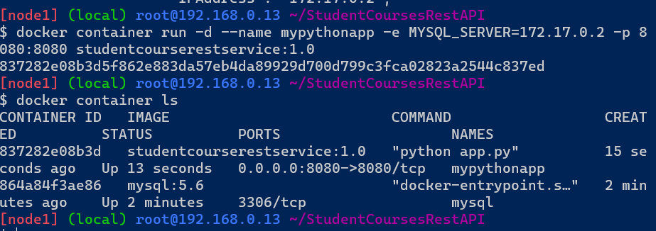
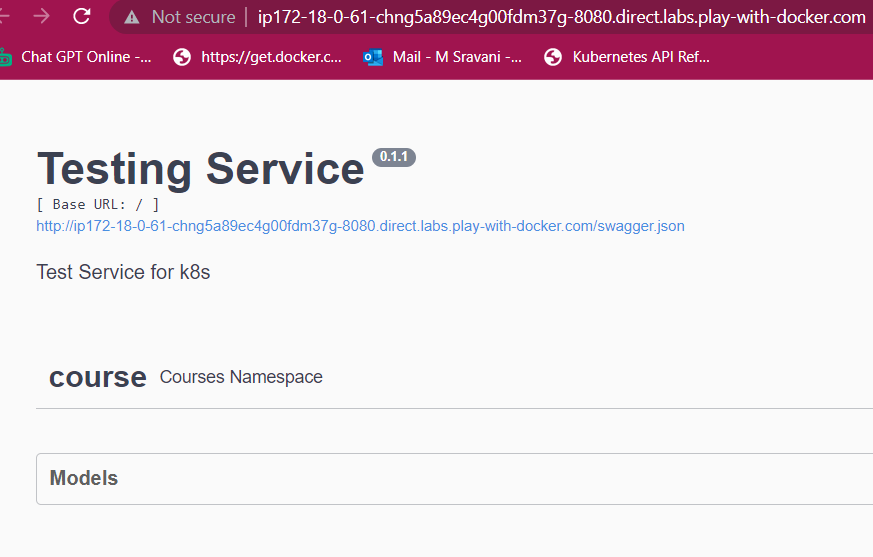


---
FROM alpine:3.17 as source
LABEL author="Manohar" project="StudentCoursesRestAPI"
RUN apk add --update && apk add git
RUN git clone https://github.com/manohargatla/StudentCoursesRestAPI.git /StudentCoursesRestAPI


FROM python:3.7-alpine
LABEL author="Manohar" project="StudentCoursesRestAPI"
COPY --from=source /StudentCoursesRestAPI /StudentCoursesRestAPI
WORKDIR /StudentCoursesRestAPI 
RUN pip install --upgrade pip 
RUN pip install -r requirements.txt
EXPOSE 8080
ENTRYPOINT ["python","app.py"]
---
---
docker image build -t scr:1.0 .
docker container run -d -P scr:1.0
---
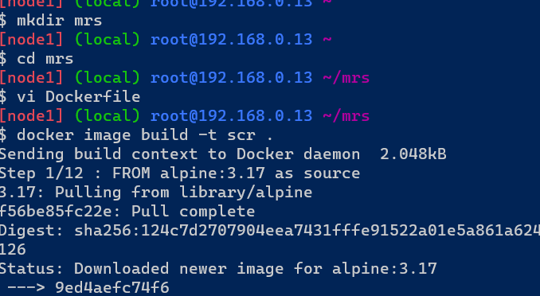


