## What is KUBERNETES?
* Kubernetes is a container management system developed in the google platform. The purpose of K8S is to manage a containerized application in various types of physical, virtual and cloud environments google K8S is a higly flexible container tool to deliver even complex applications.
* Kubernetes is an open source system to deploy, scale, and manage containerized applications anywhere.

* Autoscaling
* Containers don’t scale on their own.
* Scaling is of two types
    1. Vertical Scaling
        * Increase the size of the pod.
    2. Horizontal Scaling
        * Increase the no. of pods.
# TERMS

1. Distributed System
    * Master node will be distribute the work to worker nodes this system is called distributed system.
## 2. Node
    * Each of the server (VM) is called node.
## 3. Cluster
    * The combination of master node and worker node is called cluster.
## 4. State
    * State is a meaning full information of the application in the server.
## 5. Stateful Applications
    * data stored in somewhere in the local system 
## 6. Stateless Applications
    * data attached to a application in a external system
## 7. Monolith
    * Running whole application as it in huge server or running in one server.
## 8. Microservices
    * It is used to one whole application divided into small apps.
## 9. Desired State
    * The desired state is the state in which you want your application to be running.
## 10. Declarative vs Imperative
    * Declarative: What we have and trying to get what we want write in yaml file
    * Imperative: run the yaml file by using command lines interface (CLI)
    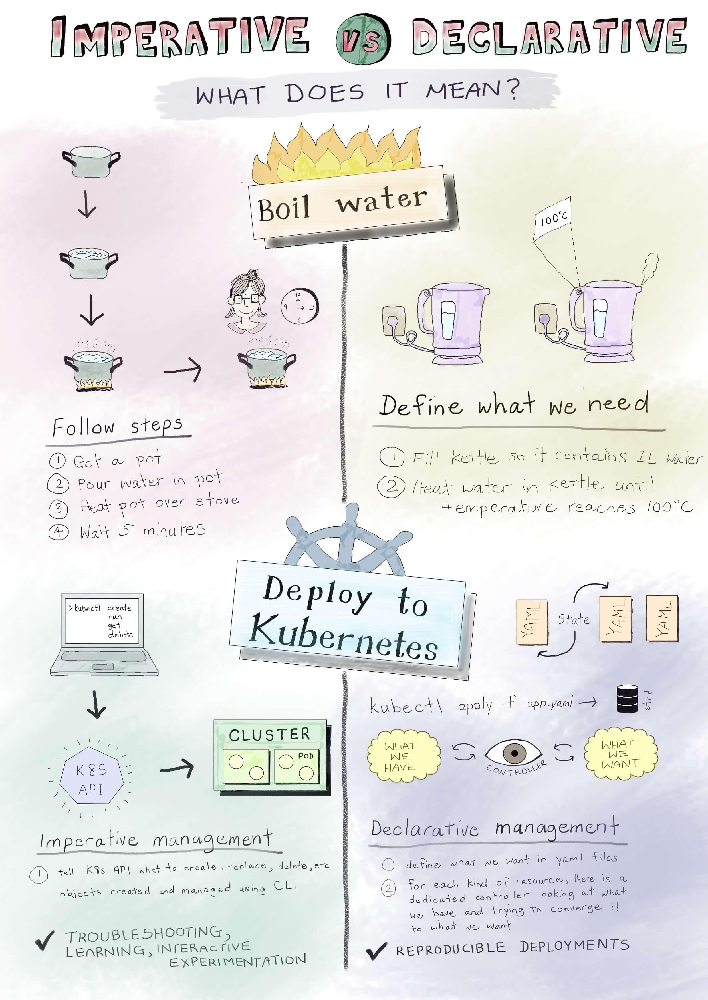
## 11. Pet Vs Cattle
    * Pet: It is static infrastructure. If one pod is failed then we repaired and use here.
    * Cattle: It is elastic infrastructure. If one pod is failed then we left and replace with new pod.

# Why you need Kubernetes and what it can do
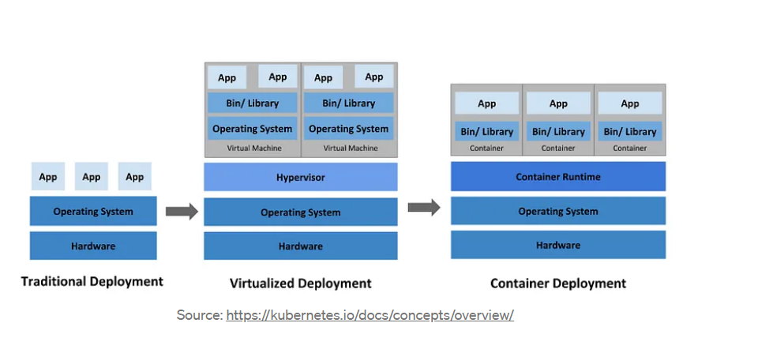
* In above visuals, we can see how organizations ran applications on physical servers. Later virtualization allowed better utilization of resources in a physical server and allowed better scalability because an application can be added or updated easily, reduces hardware costs, and much more. In container deployment, containers are similar to VMs, but they have relaxed isolation properties to share the Operating System (OS) among the applications.

* Containers are a good way to bundle and run your applications. In a production environment, you need to manage the containers that run the applications and ensure that there is no downtime. For example, if a container goes down, another container needs to start. Wouldn’t it be easier if this behavior was handled by a system?

* Kubernetes provides you with a framework to run distributed systems resiliently. It takes care of scaling and failover for your application, provides deployment patterns, and more.
* Kubernetes provides you with the following 
    * Service discovery and load balancing
    * Storage orchestration
    * Automated rollouts and rollbacks (version changes)
    * Automatic bin packing
    * Self-Healing (automatic restart)
    * Secret and configuration management
# Kubernetes Architectural Components
* When you deploy Kubernetes, you get a cluster.
* A Kubernetes cluster consists of a set of worker nods, called compute machines/nodes, that run containerized applications. The node(s) host the Pods that are the components of the application workload.
* The control plane manages the worker nodes and the Pods in the cluster.
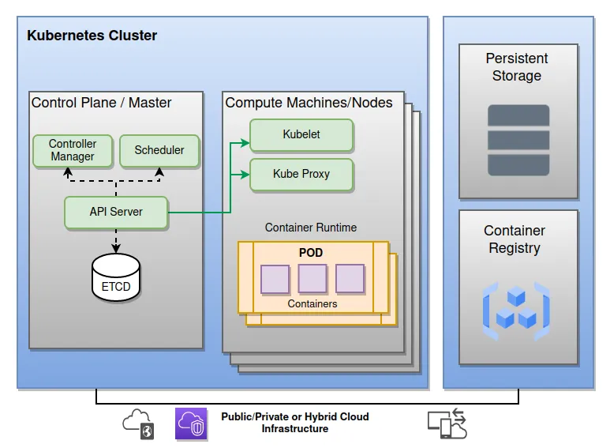
* Cluster ===> Nodes ===> Pods ===> Containers ===> Image
* The cluster is in above order.

# Control plane components
## API Server: 
    * The API server is the front end for the Kubernetes control plane.

## Scheduler: 
    * It is responsible for scheduling pods on specific nodes according to automated workflows and user defined conditions.

## Controller Manager:
    * The controller manager is responsible for several controllers that handle various automated activities at the cluster or pod level, including replication controller, namespace controller, service accounts controller, deployment, statefulset, and daemonset.

## ETCD:
    * Consistent and highly-available key value store used as Kubernetes’ backing store for all cluster data.

## Node components:
    * run on every node, maintaining running pods and providing the Kubernetes runtime environment.

## kubelet: 
    * An agent that runs on each node in the cluster. It makes sure that containers are running in a Pod.

## kube-Proxy:
    * It maintains network rules on nodes. These network rules allow network communication to your Pods from network sessions inside or outside of your cluster.

## Container Runtime:
    * The container runtime is the software that is responsible for running containers.

# What are the benefits of Kubernetes?
* Container orchestration savings
    * Orchestration is the automated configuration, management, and coordination of computer systems, applications, and services.
* Increased DevOps efficiency for microservices architecture
* Deploying workloads in multicloud environments
* More portability with less chance of vendor lock-in
* Automation of deployment and scalability
* App stability and availability in a cloud environment
* Open-source benefits of Kubernetes

# Kubernetes services
* Various vendors offer Kubernetes-based platforms (Managed Kubernetes Platform) or infrastructure as a service (IaaS) that deploy Kubernetes.
* Alibaba Cloud ACK (Alibaba Cloud Container Service for Kubernetes)
* Amazon EKS (Elastic Kubernetes Service)
* DigitalOcean managed Kubernetes Service
* Google GKE (Google Kubernetes Engine)
* IBM Cloud Kubernetes Services
* Microsoft AKS (Azure Kubernetes Services)
* Mirantis K0s
* Oracle Container Engine for Kubernetes
* Red Hat Openshift
* SUSE Rancher, Rancher Kubernetes Engine (RKE)
* VMware Tanzu

# What is k8s manifest
* This is a yaml file which describes the desired state of what you want in/using k8s cluster.

# CI/CD workflow
* step1: write a new code
* step2: build docker image with new tag
* step3: push the image to registry
* step4: deploy this in k8s cluster (environment)
* In which environment we use the pipeline will be changed by their environmently.
## K8s Installations
* Create two are more VM's with size 2vcpu's and 8Gb RAM. The following commands are enter into VM while we creating in advance
---
* #!/bin/sh
* curl -fsSL https://get.docker.com -o get-docker.sh
* sh get-docker.sh
* sudo usermod -aG docker azureuser
* sudo swapoff -a
---
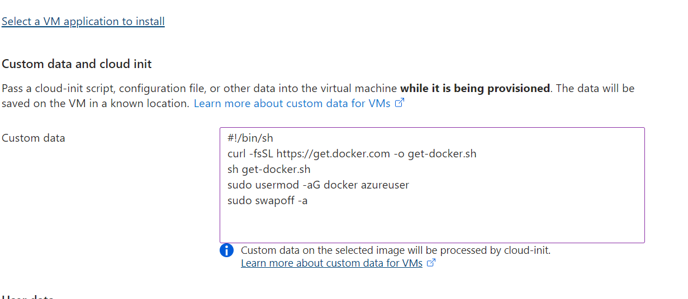
* After that creating VMs are connected to powershell and select one is the master node and other are worker nodes. then check the docker in it present or not. After that enter into root then follow the commands for installation kubernetes.
---
* wget https://storage.googleapis.com/golang/getgo/installer_linux
* chmod +x ./installer_linux
* ./installer_linux
* source /root/.bash_profile
* git clone https://github.com/Mirantis/cri-dockerd.git
* cd cri-dockerd
* mkdir bin
* go build -o bin/cri-dockerd
* mkdir -p /usr/local/bin
* install -o root -g root -m 0755 bin/cri-dockerd /usr/local/bin/cri-dockerd
* cp -a packaging/systemd/* /etc/systemd/system
* sed -i -e 's,/usr/bin/cri-dockerd,/usr/local/bin/cri-dockerd,' /etc/systemd/system/cri-docker.service
* systemctl daemon-reload
* systemctl enable cri-docker.service
* systemctl enable --now cri-docker.socket
* cd ~
* sudo curl -fsSLo /etc/apt/keyrings/kubernetes-archive-keyring.gpg https://dl.k8s.io/apt/doc/apt-key.gpg
* sudo apt-get update
* sudo apt-get install -y apt-transport-https ca-certificates curl
* echo "deb [signed-by=/etc/apt/keyrings/kubernetes-archive-keyring.gpg] https://apt.kubernetes.io/ kubernetes-xenial main" | sudo tee /etc/apt/sources.list.d/kubernetes.list
* sudo apt-get update
* sudo apt-get install -y kubelet kubeadm kubectl
* sudo apt-mark hold kubelet kubeadm kubectl
---
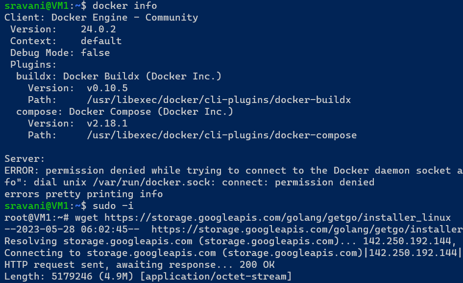
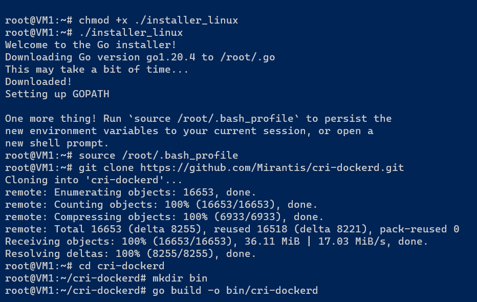
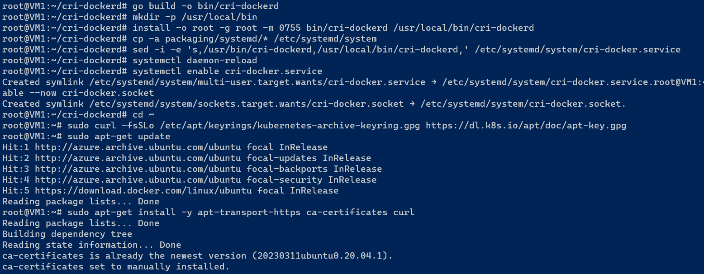
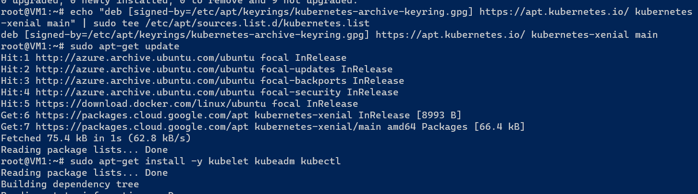
* The above commands enter into all nodes and after that the following commands enter into only in masternode
---
* kubeadm --help
* kubeadm init --pod-network-cidr "10.244.0.0/16"
* kubeadm init --pod-network-cidr "10.244.0.0/16" --cri-socket "unix:///var/run/cri-dockerd.sock"
* exit
* mkdir -p $HOME/.kube
* sudo cp -i /etc/kubernetes/admin.conf $HOME/.kube/config
* sudo chown $(id -u):$(id -g) $HOME/.kube/config
* kubectl get nodes
* kubectl get nodes -w
---
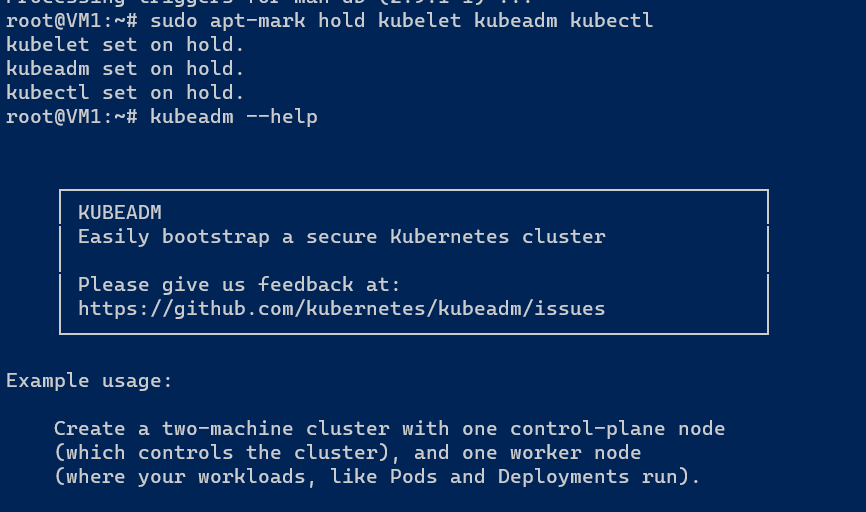
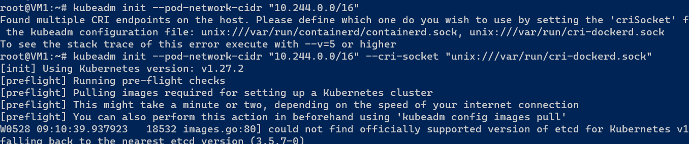
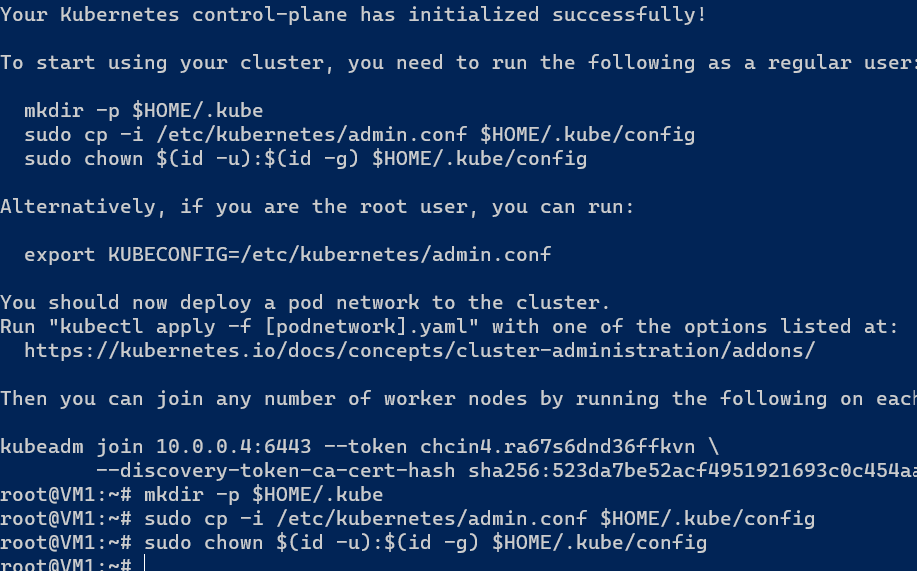
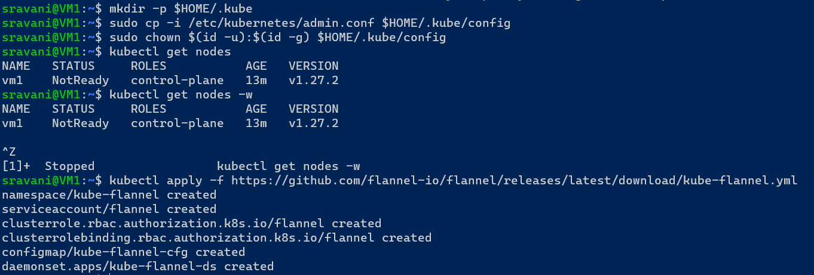
* Now do the following commands in worker node to connect to master node
---
* kubeadm join 10.0.0.4:6443 --token chcin4.ra67s6dnd36ffkvn --cri-socket "unix:///var/run/cri-dockerd.sock" --discovery-token-ca-cert-hash sha256:523da7be52acf4951921693c0c454aab4d7031cb423da9273ad1d67b2c92e8a3 
---
* Now check the master node by using following commands
---
* kubectl get nodes
* kubectl get nodes -w
---
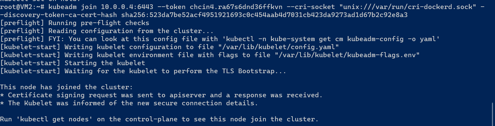
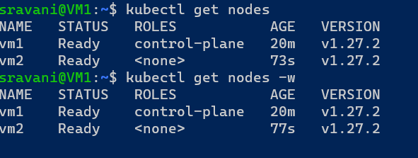
* The resources exposed by api-server
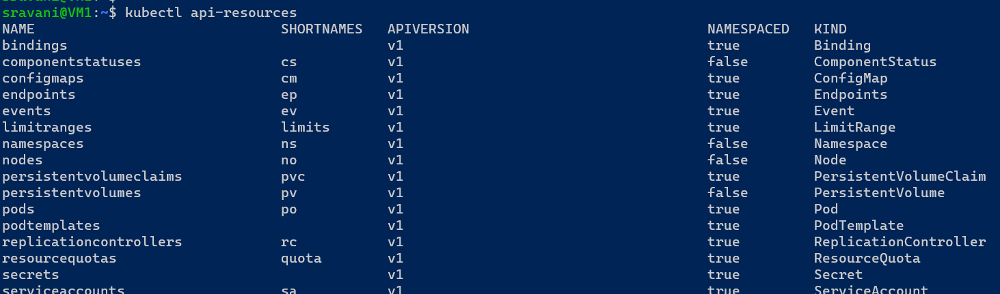
* [referhere] (https://directdevops.blog/2023/04/23/devops-classroomnotes-23-apr-2023-2/)
# How to Create Resources in K8s
We would be creating k8s manifests i.e yaml files
For this we need to understand
yaml
api versioning
Spec and Status
# K8s Workloads
* Pod
* Replicaset   
* Deployment
* Statefulsets
* Jobs
* Cornjobs
## pod:
    * The smallest unit of creation is called pod. Pods has a container. every pod gets an IP address.
* [referhere] (https://www.vmware.com/topics/glossary/content/kubernetes-pods.html#:~:text=A%20pod%20is%20the%20smallest,that%20pod%20to%20continue%20operations.)
* [Referhere] (https://kubernetes.io/docs/concepts/workloads/pods/#:~:text=Pods%20are%20the%20smallest%20deployable,how%20to%20run%20the%20containers) for the official docs
## Replica set:
    * A ReplicaSet's purpose is to maintain a stable set of replica Pods running at any given time. As such, it is often used to guarantee the availability of a specified number of identical Pods.
## Deployment:
    * A Kubernetes Deployment tells Kubernetes how to create or modify instances of the pods that hold a containerized application. Deployments can help to efficiently scale the number of replica pods, enable the rollout of updated code in a controlled manner, or roll back to an earlier deployment version if necessary.
* [referhere] (https://www.vmware.com/topics/glossary/content/kubernetes-deployment.html#:~:text=A%20Kubernetes%20Deployment%20tells%20Kubernetes,earlier%20deployment%20version%20if%20necessary) for docs
## Statefulsets:
    * StatefulSet is the workload API object used to manage stateful applications. Manages the deployment and scaling of a set of Pods, and provides guarantees about the ordering and uniqueness of these Pods. Like a Deployment, a StatefulSet manages Pods that are based on an identical container spec.
* [referhere] (https://kubernetes.io/docs/concepts/workloads/controllers/statefulset/#:~:text=StatefulSet%20is%20the%20workload%20API,on%20an%20identical%20container%20spec.)
## Jobs:
    * A Job creates one or more Pods and will continue to retry execution of the Pods until a specified number of them successfully terminate. As pods successfully complete, the Job tracks the successful completions. When a specified number of successful completions is reached, the task (ie, Job) is complete.
## Cornjobs:
    * A CronJob creates Jobs on a repeating schedule. CronJob is meant for performing regular scheduled actions such as backups, report generation, and so on. One CronJob object is like one line of a crontab (cron table) file on a Unix system. It runs a job periodically on a given schedule, written in Cron format.
## API Versioning
* APIs are grouped as apigroups:
    * core
    * batch
    * networking.k8s.io
* Api version: This is written as <groupname>/<Version>, if the group name is core <version>
* In this groups we have kind of api-resources.
## Defining Resources in a manifest file
* To define a resource in a manifest file we create a yaml file with following structure
    * apiVersion: 
    * kind:
    * metadata:
    * spec:
## Pod lifecycle
* K8s Pods will have following states
    * Pending
    * Running
    * Succeded
    * Failed
    * Unknown
## Container States in k8s pod
### Waiting:
    * If a container is not in either the Running or Terminated state, it is Waiting. A container in the Waiting state is still running the operations it requires in order to complete start up: for example, pulling the container image from a container image registry, or applying Secret data. When you use kubectl to query a Pod with a container that is Waiting, you also see a Reason field to summarize why the container is in that state.
### Running:
    * The Running status indicates that a container is executing without issues. If there was a postStart hook configured, it has already executed and finished. When you use kubectl to query a Pod with a container that is Running, you also see information about when the container entered the Running state.
### Terminated: 
    * A container in the Terminated state began execution and then either ran to completion or failed for some reason. When you use kubectl to query a Pod with a container that is Terminated, you see a reason, an exit code, and the start and finish time for that container's period of execution.
    * If a container has a preStop hook configured, this hook runs before the container enters the Terminated state.
## Pod conditions
* A Pod has a PodStatus, which has an array of PodConditions through which the Pod has or has not passed. Kubelet manages the following PodConditions:
    * PodScheduled: the Pod has been scheduled to a node.
    * PodHasNetwork: (alpha feature; must be enabled explicitly) the Pod sandbox has been successfully created and networking configured.
    * ContainersReady: all containers in the Pod are ready.
    * Initialized: all init containers have completed successfully.
    * Ready: the Pod is able to serve requests and should be added to the load balancing pools of all matching Services.
# Controllers in K8s
* Controllers are k8s objects which run other k8s resources. This k8s resource will be part of specification generally in template section.
* Controllers maintain desired state. Some of the controllers are
    * Replication Controller/Replica Set
    * Stateful Sets
    * Deployments
    * Jobs
    * Cron Jobs
    * Daemonset
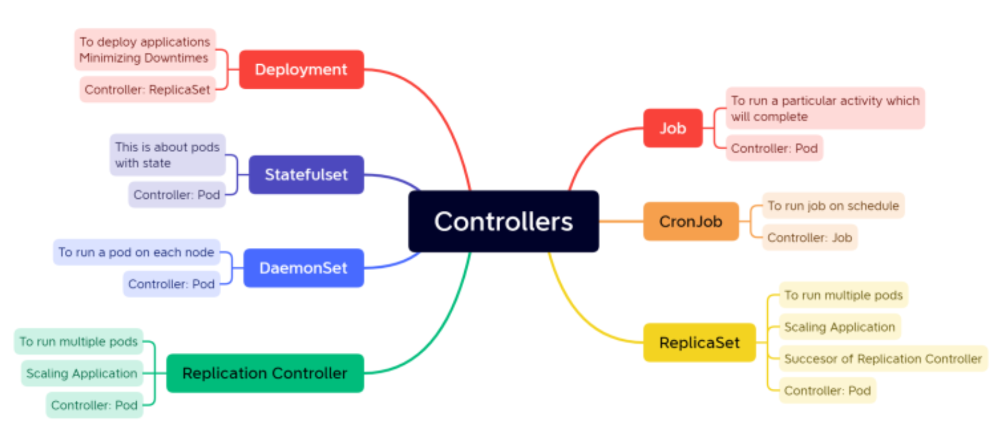
## K8s has two types of jobs
* Job: Run an activity/script to completion
* CronJob: Run an activity/script to completion at specific time period or intervals.
## Metadata
* Every object kind MUST have the following metadata in a nested object field called "metadata".
### namespace:
    * a namespace is a DNS (Domain Name system) compatible label that objects are subdivided into. The default namespace is 'default'. See the namespace docs for more.
### name:
    * a string that uniquely identifies this object within the current namespace (see the identifiers docs). This value is used in the path when retrieving an individual object.
### uid:
    * a unique in time and space value (typically an RFC 4122 generated identifier, see the identifiers docs) used to distinguish between objects with the same name that have been deleted and recreated. 
* Every object SHOULD have the following metadata in a nested object field called "metadata":
### resourceVersion:
    * a string that identifies the internal version of this object that can be used by clients to determine when objects have changed. This value MUST be treated as opaque by clients and passed unmodified back to the server. Clients should not assume that the resource version has meaning across namespaces, different kinds of resources, or different servers. (See concurrency control, below, for more details.)
### generation:
    * a sequence number representing a specific generation of the desired state. Set by the system and monotonically increasing, per-resource. May be compared, such as for RAW and WAW consistency.
### creationTimestamp:
    * a string representing an RFC 3339 date of the date and time an object was created
### deletionTimestamp:
    * a string representing an RFC 3339 date of the date and time after which this resource will be deleted. This field is set by the server when a graceful deletion is requested by the user, and is not directly settable by a client. The resource will be deleted (no longer visible from resource lists, and not reachable by name) after the time in this field except when the object has a finalizer set. In case the finalizer is set the deletion of the object is postponed at least until the finalizer is removed. Once the deletionTimestamp is set, this value may not be unset or be set further into the future, although it may be shortened or the resource may be deleted prior to this time.
### labels:
    * a map of string keys and values that can be used to organize and categorize objects (see the labels docs)
### annotations:
    * a map of string keys and values that can be used by external tooling to store and retrieve arbitrary metadata about this object (see the annotations docs)
Labels are intended for organizational purposes by end users (select the pods that match this label query). Annotations enable third-party automation and tooling to decorate objects with additional metadata for their own use.

## Cron job format:
    * A schedule is defined using the unix-cron string format ( * * * * * ) which is a set of five fields in a line, indicating when the job should be executed.
    * In this five strings indicates 
            * 1. *-minute
            * 2. *-hour
            * 3. *-date
            * 4. *-month
            * 5. *-day
### ReplicaSet
* to create a replicaset controller and excute that
* for replicaset watch activity1.yaml file
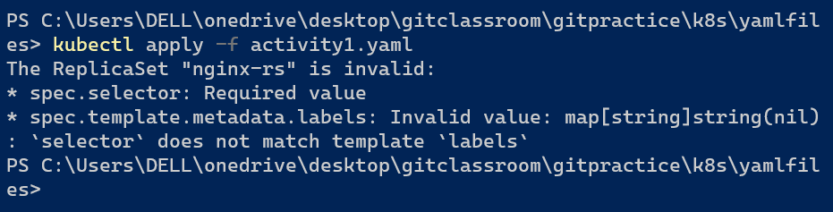
* now add the labels at metadata

### 1. What is Kubernetes?
* Kubernetes is an open-source container orchestration tool or system that is used to automate tasks such as the management, monitoring, scaling, and deployment of containerized applications.
### 2. What process runs on Kubernetes Master Node? 
The Kube-api server process runs on the master node and serves to scale the deployment of more instances.

