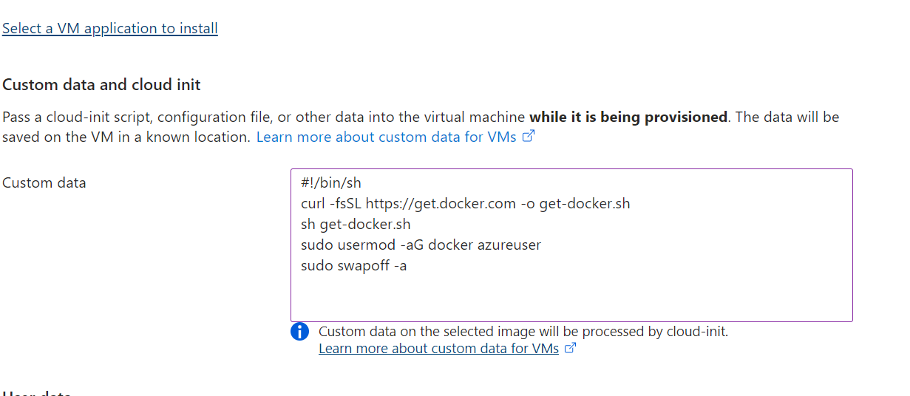
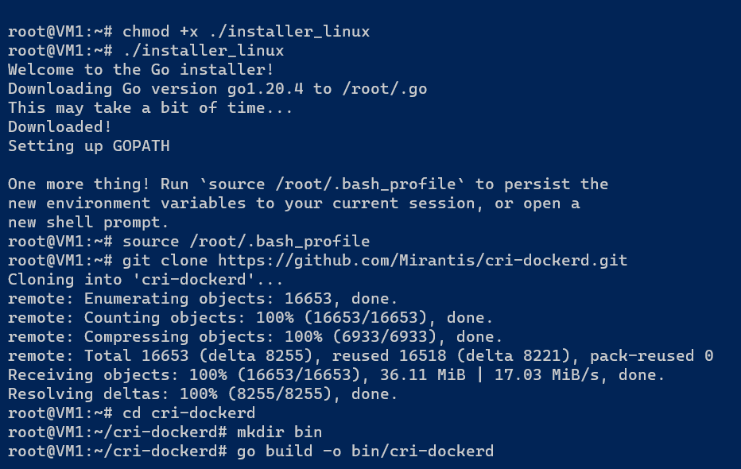
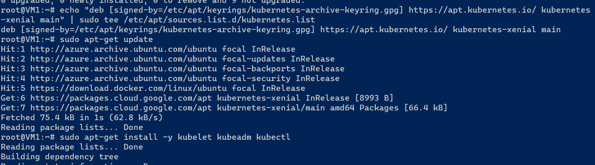

# DAY-1
## Have the installation of Kubernetes (K8S) cluster by using kubeadm?
* Create two are more VM's with size 2vcpu's and 8Gb RAM. The following commands are enter into VM while we creating in advance
---
* #!/bin/sh
* curl -fsSL https://get.docker.com -o get-docker.sh
* sh get-docker.sh
* sudo usermod -aG docker azureuser
* sudo swapoff -a
---

* After that creating VMs are connected to powershell and select one is the master node and other are worker nodes. then check the docker in it present or not. After that enter into root then follow the commands for installation kubernetes.
---
* wget https://storage.googleapis.com/golang/getgo/installer_linux
* chmod +x ./installer_linux
* ./installer_linux
* source /root/.bash_profile
* git clone https://github.com/Mirantis/cri-dockerd.git
* cd cri-dockerd
* mkdir bin
* go build -o bin/cri-dockerd
* mkdir -p /usr/local/bin
* install -o root -g root -m 0755 bin/cri-dockerd /usr/local/bin/cri-dockerd
* cp -a packaging/systemd/* /etc/systemd/system
* sed -i -e 's,/usr/bin/cri-dockerd,/usr/local/bin/cri-dockerd,' /etc/systemd/system/cri-docker.service
* systemctl daemon-reload
* systemctl enable cri-docker.service
* systemctl enable --now cri-docker.socket
* cd ~
* sudo curl -fsSLo /etc/apt/keyrings/kubernetes-archive-keyring.gpg https://dl.k8s.io/apt/doc/apt-key.gpg
* sudo apt-get update
* sudo apt-get install -y apt-transport-https ca-certificates curl
* echo "deb [signed-by=/etc/apt/keyrings/kubernetes-archive-keyring.gpg] https://apt.kubernetes.io/ kubernetes-xenial main" | sudo tee /etc/apt/sources.list.d/kubernetes.list
* sudo apt-get update
* sudo apt-get install -y kubelet kubeadm kubectl
* sudo apt-mark hold kubelet kubeadm kubectl
---

## Write a Pod Spec for Spring PetClinic and nopCommerce Applications?
* yaml file for Spring PetClinic
---
        apiVersion: v1
        kind: Pod
        metadata:
        name: Spring-petclinic 
        spc:
        name: Sping-petclinic
        image: Sping-petclinic
        ports:
            - containerport: 8080
---
* to excute the above do

3.Execute the kubectl commands: kubectl get pods and describe po?