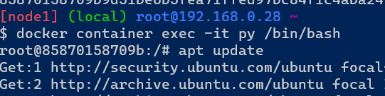
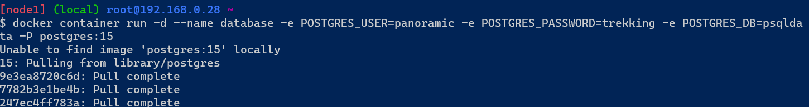
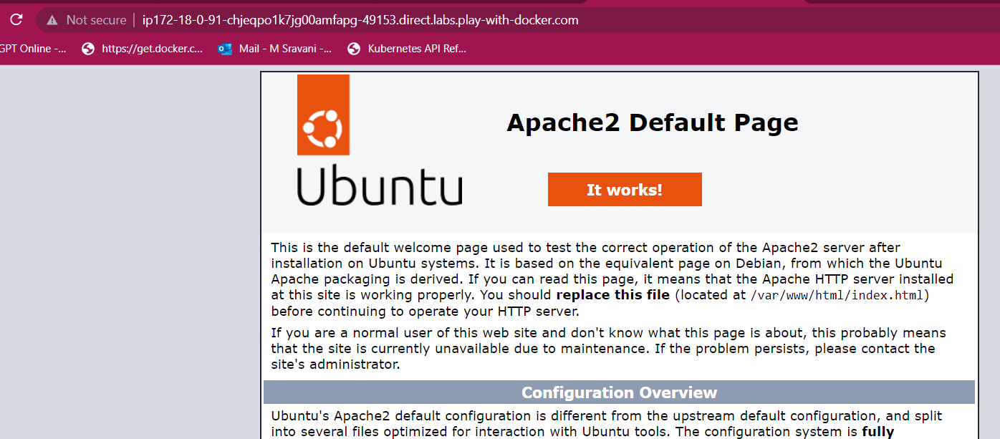

### Create an alpine container in interactive mode and install python
* Manual ste* Create a container by using following commands
* login to docker playground in terminal
* Manual ste
* Create a container by using following commands
* ---
* <docker container run -it --name sravani alpine:latest>
* <apk --update upgrade>
* apk add python3
* <python3 --version>
* ---
* Manual ste* Create a container by using following commands
* Manual ste* Create a container by using following commands

* 
* By using Dockerfile and create container
* ---
* FROM alpine:latest
  LABEL author="sravani" organization="techinfo" project="python"
  RUN apk --update upgrade
  RUN apk add python3
  CMD ["python3 --version"]
* ---
* Now build the image by using following command
* ---
* <docker image build -t python .>
* <docker image ls>
* ---
* 
* 

### Create a ubuntu container with sleep 1d and then login using exec and install python
* login to docker playground in terminal and create container by using following commands.
* ---
* docker container run -d --name py -P ubuntu:20.04 sleep 1d
* docker container exec -it py /bin/bash
* apt update
* apt install python3 -y
* python3 --version
* ---
* 
* 
* 
* 

### Create a postgres container with username panoramic and password as trekking. Try logging in and show the databases (query for psql)
* login to docker playground in terminal and create postgres by using following commands
* ---
* docker container run -d --name database -e POSTGRES_USER=panoramic -e POSTGRES_PASSWORD=trekking -e POSTGRES_DB=psqldata -P postgres:15
* docker container exec -it database postgres --password=trekking
* docker exec -it database /bin/bash
* psql --help
* ---
* 
* 
* To create table 
* ---
* psql -U panoramic -W trekking -d psqldata
* CREATE TABLE Persons (
    PersonID int,
    LastName varchar(295),
    FirstName varchar(295),
    Address varchar(295),
    City varchar(295)
);
* Insert into Persons Values (1, 'sravani', 'mutluri', 'ameerpet', 'hyd');
* Insert into Persons Values (2, 'srinivas', 'mutluri', 'ameerpet', 'hyd'); 
* SELECT * from Persons;
* ---
* 
* 

### Try to create a docker file which runs php info page, use ARG and ENV wherever appropriate on
* apache server
* login to docker playground in terminal and create a dockerfile for apache server
* ---
* FROM ubuntu:22.04
  LABEL author="sravani" organization="QT tech" project="apache"
  ARG DEBIAN_FRONTEND=noninteractive
  RUN apt update && apt install apache2 -y
  RUN apt install php libapache2-mod-php -y
  RUN echo "<?php phpinfo() ?>" >> /var/www/html/info.php
  EXPOSE 80
  CMD ["apache2ctl","-D","FOREGROUND"] 
* ---
* After creating dockerfile to build the image use the following commands.
* ---
* docker image build -t apache .
* docker container run --name php -d -P apache
* docker container ls
* ---
* 
* 
* Now we observe the port number and open that port.
* 
