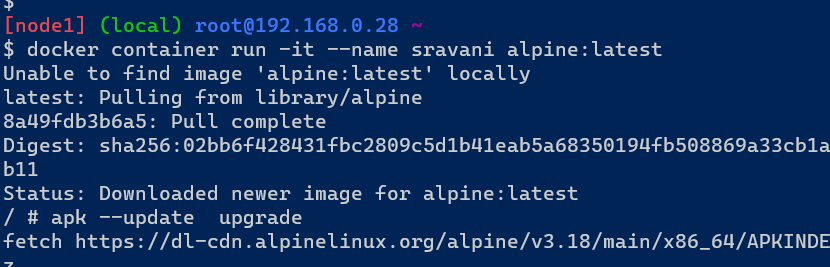
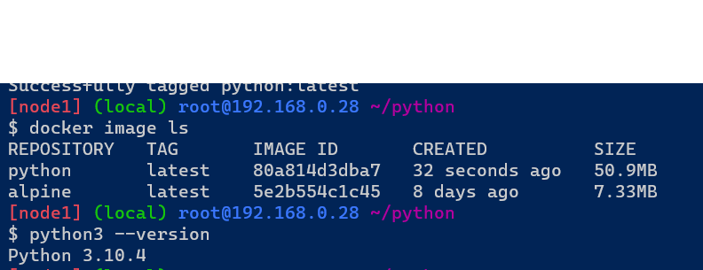
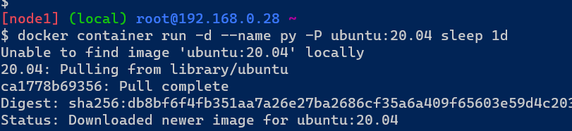
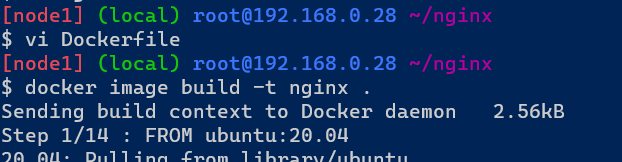
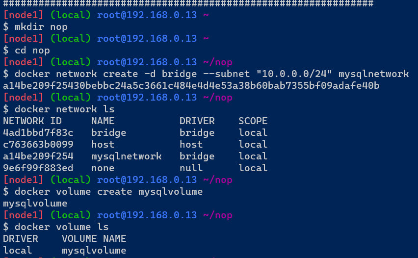
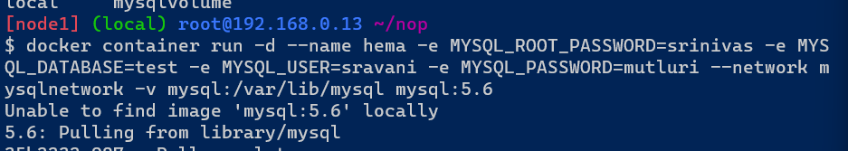
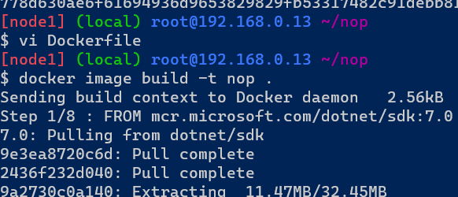
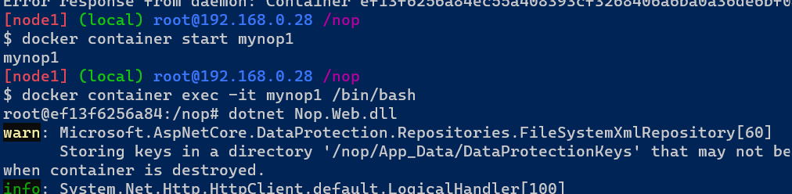

#### DAY1
# Run hello-world docker container and observe the container status


# Docker installation steps
* To install docker firstly we have to create a linux machine.
* Required commands for installation of docker
---
* `sudo apt update`
* `curl -fsSL https://get.docker.com -o get-docker.sh` && `sh get-docker.sh`
* `sudo usermod -aG docker ubuntu`
---
* Exit from the linux machine
  * Reconnect it 
  * type the command `docker info`
  * DOCKER WORKBOOK – 1
* RUNNING DOCKER CONTAINERS  
* Run hello-world docker container and observe the container status?
  * `docker container run -d -P --name myworld hello-world:latest`
  * `docker container run -it -P --name myworld hello-world:latest`
  * To see the container is running or not `docker container ls`

#### DAY4
### Create an alpine container in interactive mode and install python
* Manual step
* Create a container by using following commands
* ---
* <docker container run -it --name sravani alpine:latest>
* <apk --update upgrade>
* apk add python3
* <python3 --version>
* ---
* 
* 
* By using Dockerfile and create container
* ---
* FROM alpine:latest
  LABEL author="sravani" organization="techinfo" project="python"
  RUN apk --update upgrade
  RUN apk add python3
  CMD ["python3 --version"]
* ---
* Now build the image by using following command
* ---
* <docker image build -t python .>
* <docker image ls>
* ---
* 
* 

### Create a ubuntu container with sleep 1d and then login using exec and install python
* login to docker playground in terminal and create container by using following commands.
* ---
* docker container run -d --name py -P ubuntu:20.04 sleep 1d
* docker container exec -it py /bin/bash
* apt update
* apt install python3 -y
* python3 --version
* ---
* 
* 
* 
* 

### Create a postgres container with username panoramic and password as trekking. Try logging in and show the databases (query for psql)
* login to docker playground in terminal and create postgres by using following commands
* ---
* docker container run -d --name database -e POSTGRES_USER=panoramic -e POSTGRES_PASSWORD=trekking -e POSTGRES_DB=psqldata -P postgres:15
* docker container exec -it database postgres --password=trekking
* docker exec -it database /bin/bash
* psql --help
* ---
* 
* 
* To create table 
* ---
* psql -U panoramic -W trekking -d psqldata
* CREATE TABLE Persons (
    PersonID int,
    LastName varchar(295),
    FirstName varchar(295),
    Address varchar(295),
    City varchar(295)
);
* Insert into Persons Values (1, 'sravani', 'mutluri', 'ameerpet', 'hyd');
* Insert into Persons Values (2, 'srinivas', 'mutluri', 'ameerpet', 'hyd'); 
* SELECT * from Persons;
* ---
* 
* 

### Try to create a docker file which runs php info page, use ARG and ENV wherever appropriate on
# apache server
* login to docker playground in terminal and create a dockerfile for apache server
* ---
* FROM ubuntu:22.04
  LABEL author="sravani" organization="QT tech" project="apache"
  ARG DEBIAN_FRONTEND=noninteractive
  RUN apt update && apt install apache2 -y
  RUN apt install php libapache2-mod-php -y
  RUN echo "<?php phpinfo() ?>" >> /var/www/html/info.php
  EXPOSE 80
  CMD ["apache2ctl","-D","FOREGROUND"] 
* ---
* After creating dockerfile to build the image use the following commands.
* ---
* docker image build -t apache .
* docker container run --name php -d -P apache
* docker container ls
* ---
* 
* 
* Now we observe the port number and open that port.
* 

# nginx server
* login to docker playground in terminal and create a dockerfile for nginx server
* ---
* FROM ubuntu:22.04
  LABEL author="sravani" organization="techinfo" project="nginx"
  ARG DEBIAN_FRONTEND=noninteractive
  RUN apt update && apt upgrade -y
  RUN apt install nginx -y
  RUN apt install php php-fpm -y
  RUN rm -rf /var/lib/apt/lists/
  COPY nginx.conf /etc/nginx/sites-available/default
  RUN chmod -R 777 /var/www/html
  RUN echo "<?php phpinfo() ?>" >> /var/www/html/info.php
  EXPOSE 80
  ENTRYPOINT ["/bin/bash","-c","service php-fpm start && nginx -g 'daemon off;'"]
  CMD ["nginx","-g","daemon off;"]
* ```
* After creating dockerfile to build the image use the following commands.
* ---
* docker image build -t nginx .
* docker container run --name php -d -P nginx
* docker container ls
* ---
* 
* 

### Create a Jenkins image by creating an own docker file
* login to docker playground in terminal and create a dockerfile for jenkins server
* ---
* FROM ubuntu:22.04
  LABEL author="sravani" organization="techinfo" project="jenkins"
  RUN apt update && apt install openjdk-11-jdk maven curl -y
  RUN curl -fsSL https://pkg.jenkins.io/debian-stable/jenkins.io-2023.key | tee \
      /usr/share/keyrings/jenkins-keyring.asc > /dev/null
  RUN echo deb [signed-by=/usr/share/keyrings/jenkins-keyring.asc] \
      https://pkg.jenkins.io/debian-stable binary/ | tee \
      /etc/apt/sources.list.d/jenkins.list > /dev/null
  RUN apt-get update 
  RUN apt-get install jenkins -y
  EXPOSE 8080
  CMD ["/usr/bin/jenkins"]
* ---
* After creating dockerfile to build the image use the following commands.
* ---
* docker image build -t sravani .
* docker container run -d --name sravani -P jenkins/jenkins
* ---
* 
*  

### Create nop commerce and MySQL server and try to make them work by configuring
# nop commerce
* 
---
* FROM mcr.microsoft.com/dotnet/sdk:7.0
  LABEL author="sravani" organization="techinfo" project="nopcommerce"
  ADD https://github.com/nopSolutions/nopCommerce/releases/download/release-4.60.2/nopCommerce_4.60.            2_NoSource_linux_x64.zip /nop/nopCommerce_4.60.2_NoSource_linux_x64.zip
  WORKDIR /nop
  RUN apt update && apt install unzip -y && \
      unzip /nop/nopCommerce_4.60.2_NoSource_linux_x64.zip && \
      mkdir /nop/bin && mkdir /nop/logs
  EXPOSE 5000
  ENV ASPNETCORE_URLS="http://0.0.0.0.0:5000"
  CMD [ "dotnet", "Nop.Web.dll" ]
---
* After creating dockerfile to build the image use the following commands.
---
* docker image build -t nop .
* docker network create -d bridge --subnet "10.0.0.0/24" mysqlnetwork
* docker volume create mysqlvolume
* docker container run --name mynop1 -d -P --network mysqlnetwork -e MYSQL_SERVER=mysqldb nop
* docker container run -d --name hema -e MYSQL_ROOT_PASSWORD=srinivas -e MYSQL_DATABASE=test -e MYSQL_USER=sravani -e MYSQL_PASSWORD=mutluri --network mysqlnetwork -v mysql:/var/lib/mysql mysql:5.6
* docker container ls
---
*  
*  
* 
* 
* 
* 

#### DAY 5
### Multi stage Docker file and push images to azure/aws registries and docker compose file for following applications
## nopCommerce


## stage-1
  FROM ubuntu:22.04 as nopCommerce
  RUN apt update && apt install unzip -y
  ARG DOWNLOAD_URL=https://github.com/nopSolutions/nopCommerce/releases/download/release-4.60.2/nopCommerce_4.60.2_NoSource_linux_x64.zip
  ADD ${DOWNLOAD_URL} /nopCommerce/nopCommerce_4.60.2_NoSource_linux_x64.zip
  RUN cd /nopCommerce && unzip nopCommerce_4.60.2_NoSource_linux_x64.zip && \
  mkdir bin logs && rm nopCommerce_4.60.2_NoSource_linux_x64.zip
## stage-2
  FROM mcr.microsoft.com/dotnet/sdk:7.0
  LABEL author="manu" organization="khaja.tech" project="nop"
  ARG DIRECTORY=/nop
  WORKDIR ${DIRECTORY}
  COPY --from=nopCommerce  /nopCommerce ${DIRECTORY}
  EXPOSE 5000
  ENV ASNETCORE_URLS="http://0.0.0.0:5000"
  CMD ["dotnet","Nop.Web.dll","--urls","http://0.0.0.0:5000"] 
  